# Visual Studio Code ile Git Kullanımı 

# Contents
* [Commit İşlemi ve Yapısı](#commit)
* [Git History İle Dosya Geçmişini Görüntüleme](#git-history-file)
* [Git History İle Commit Geçmişini Görüntüleme](#git-history-commit)
* [Diff İle Farklılıkların Görüntülenmesi](#diff)
* [Discard Changes İle Değişikliklerin İptal Edilmesi](#discard-changes)
* [Undo Last Commit İle Son Commit'e Geri Dönmek](#undo)
* [Revert İşlemi İle Commit Geri Alma](#revert)
* [Staged ve Unstaged İşlemleri](#staged-unstaged)
* [Commit Amend ve Signed Off Mantığı](#amend-signed-off)
* [Stash İle Değişiklikleri Saklamak](#git-stash)
* [Stash'deki Değişiklikleri Uygulama, Silme ve Değiştirme](#stash-changes)
* [Branch Oluşturma ve Merge İşlemleri](#branch-merge)
* [Git History İle Branch Oluşturma](#git-history-branch)
* [Conflict(Çakışma) Yönetimi](#conflict)
* [Tag(Etiket) Kullanımı](#tag)
* [Ignore Dosyaları Önemi ve Kullanımı](#ignore)

## Commit İşlemi ve Yapısı 
Proje geliştirme sürecinde git ile çalışırken amacımız versiyonlamaktı. İster Visual Studio olsun ister Visual Studio Code olsun 
amacımız versiyonlamak. Şimdi Visual Studio Code ile bunu deneyelim. 

Visual Studio'da proje klasörümüzü açtıktan sonra üzerinde çalışmak için index.html, style.css ve script.js dosyalarını 
oluşturalım. Biz önceden Initialize Repository diyerek zaten git'i eklemiştik ve Publish On Github diyerek de proje 
klasörümüzü github'da paylaşmıştık. Yani bu işlemlerden sonra bu klasör git tarafından kontrol ediliyor. Klasör yapımız içerisine 
baktığımızda .git klasörünü görürüz. Yani bu klasör git tarafından yönetiliyor demek. 

Projeye git'i ekledikten sonra da commit mantığına bakalım. Git ile commit yapısının biraz daha detaylandırılması gerekiyor. 
Commit aslında neleri içeriyor, buna bir değinelim. Yani biz commit yaparken aslında ne oluyor? Üzerinde çalıştığımız proje klasörü
yani git'e eklediğimiz klasör aslında bizim Working Directory dediğimiz klasör, yani git buna Working Directory diyor, yani
çalışma klasörü. İçerisinde de bizim projemizin dosyaları var. Biz commit işlemi yapmak istediğimizde aslında ilk olarak bunun 
Staging denen ara katmana eklenmesi gerekiyor. Bu işlemi de yaparken git'de bulunan add komutunu kullanıyoruz. Bunu VS Code 
üzerinde yazdığımız komut gerçekleştiriyor. Ve add komutu ile ilgili değişikliklerin olduğu dosyalar ilk olarak staging area'ya 
alınıyor. Burada derlenir indexlenir. Ardından commit işlemi gerçekleştirilerek local repository'ye kalıcı bir versiyonlama 
oluşturulur. Yani o anki değişiklikler artık commit'lenmiştir, onaylanmış, kaydedilmiştir. Numaralandırılarak commit işlemi 
gerçekleştirilir. 

Yani bir commit aslında 2 aşamadır. İlk önce değişiklikleri add komutu ile staging area'ya ekleme ve sonra değişikliklerin local
repository'ye commit edilmesi. Local repository dediğimiz şey de aslında veri tabanı diyebiliriz. Değişikliklerin git'in 
veri tabanına eklenmesi. 

Geri alma işlemlerinde ise 2 tür geri almamız söz konusudur. Birincisi daha commit etmeden, yani staging area'ya aldığımız verilerin
geri alınması, yani üzerinde çalıştığımız klasörde bir şeyler değiştirdik, o değişiklikleri add komutu ile staging area'ya aldık, 
işte oradan geriye Reset komutuyla unstage ederek tekrar o değişiklikleri iptal edip çalışma klasörümüze geri döndürebiliriz. 
Bu sefer değişiklikleri geri almış oluruz. Yani projeyi bozduğumuzu düşünnüyoruz ya da beklenmedik şeyler oldu, yaptığımız tüm 
değşiklikleri daha hiç commit etmeden reset komutuyla geri alabiliriz. 

Ama eğer değişiklik yapıp staging area'ya da ekledikten sonra commitlediysek ve geri almak istiyorsak bu sefer de Reset Commit
işlemi yani Undo Last Commit dediğimiz bu undo işlemi yaparak bir önceki versiyona geri dönme işlemini yapabiliriz. 

Yani staging kısmından ya da commitlenmiş repository'den geriye dönme şansımız söz konusu. Şimdi bu işlemleri VS Code üzerinde
deneyelim. Sol tarafta bulunan navigasyon bar'da Source Control alanını seçip git kısmına gelebiliriz. 

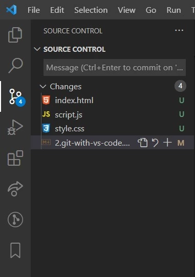

Yine o kısımda yapılan değişiklikleri önce Changes'ın yanında bulunan + işaretiyle staging area'ya alabiliriz. Ardından orada 
bulunan bar'a yapılan değişiklikleri açıklayan mantıklı bir açıklama ifadesi yazarız ve en son da o mesaj barının üzerinde bulunan
tik işaretiyle commitleriz.

Burada yapılan commit'lerin anlamlı olması gerekir. Yani bir görevi bitirdikten sonra o görevi, değişiklikleri belirten 
bir commit mesajı ile commit yapılmalıdır. Biz buradaki değişiklikleri initial commit diye açıklayarak kaydedebiliriz. Bir 
proje içerisinde gerekli dosyalar oluşturulduktan sonra genelde ilk commit bu şekilde adlandırılır. 

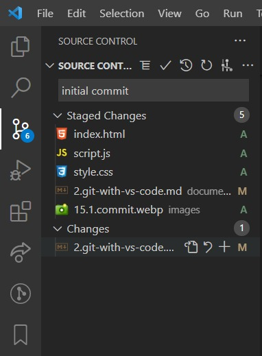

Örneğin index.html dosyamıza 2 tane paragraf ekleyelim. (2 tane p elementi)

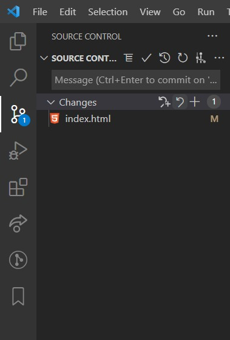

Burada Changes altında değiştirilen dosyaları görebiliriz ve artık burada index.html yanında U(untracked) yazmaz, M(Modified) yazar çünkü biz bir sefer o dosyayı tracked konumuna yani izlemeye aldık. Yine burada + ile değişiklikleri staged konumuna alabiliriz ve ardından mesajımızı yazıp commitleyebiliriz. 
## Git History İle Dosya Geçmişini Görüntüleme 
Bu bölümde ise commit'lerimiz arasında nasıl gezeceğiz, commtitleri nasıl görüntüleyeceğiz ve aralarındaki farkları nasıl
görecğiz, bu konulara değinelim. Bunun için bir Visual Studio Code extension'ından(eklenti) faydalanacağız. VS Code üzerinde 
extensions kısmına geçip oradaki search kısmında Git History yazalım ve açılan eklentiyi indirelim.

 

Git History eklentisi aracılığıyla biz commitlerimizin geçmişini görüntüleybileceğiz. 

Bu eklentiyi kurduktan sonra şimdi projemizde commitler yapalım. index.html sayfamıza 2 yeni paragraf ekleyebiliriz. Daha sonra ise "Add 2 new paragraphs in index.html page." isimli bir commit mesajıyla commit yapabiliriz.

Ardından yeni commitler de görmek adına yine 3 yeni paragraf ekleyelim ve bu sefer de ayrıca style.css dosyasında değişiklikler yapalım. En son da bu değişiklikleri yine commitleyelim. 

Şimdi de style.css'e gidip padding'e ve margin'e 0 verelim ve bu değişikliği de commit yapalım.

Amacımız burada projede farklı değişikliklerin olduğu farklı commitler gerçekleştirmekti. Bunu yaptık. Şimdi ise Git History
eklentisi ile bu commitleri inceleyeceğiz. 

Biz Git History ile projemiz üerindeki herhangi bir dosyanın tüm commit geçmişlerini görüntüleyebiliyoruz. Onun için sol tarafta
dosyayı seçtikten sonra üzerinde sağ tıklayıp Git: View File History demeliyiz.

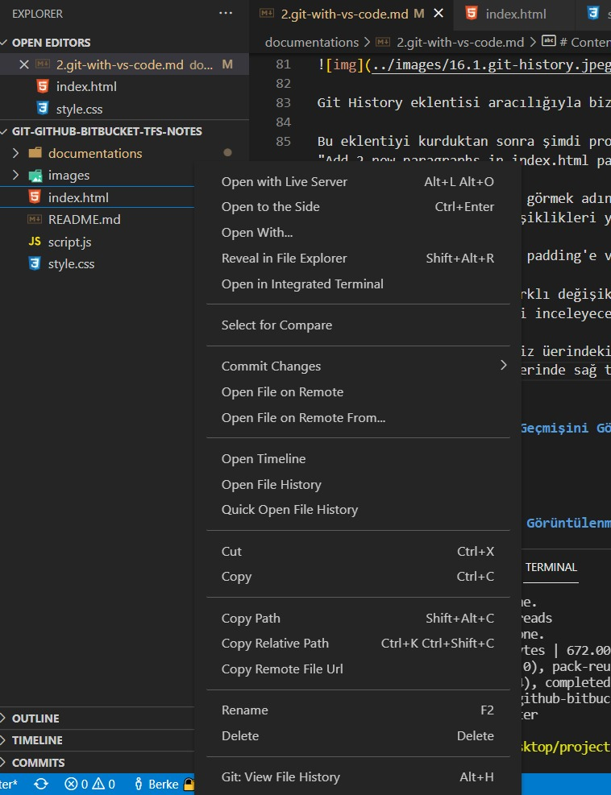 

Git: View File History'ye basınca bize o dosyanın geçtiği tüm commitleri listeliyor olacak. 

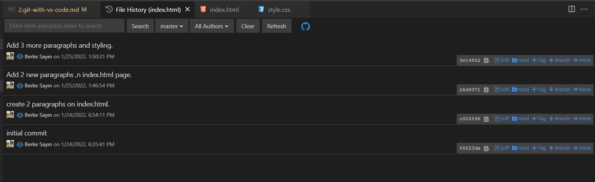 

Burada herhangi bir commit'i de seçersek o commit içerisindeki değişikliğe uğarmış dosyaları görebiliriz. O commitin kimin tarafından
hangi tarihte, hangi saatte yapıldığını görebiliriz ve burada o commitle hangi dosyalarda değişiklik olduğuyla beraber kaç adet 
değişiklik olduğunu da görebiliriz. 

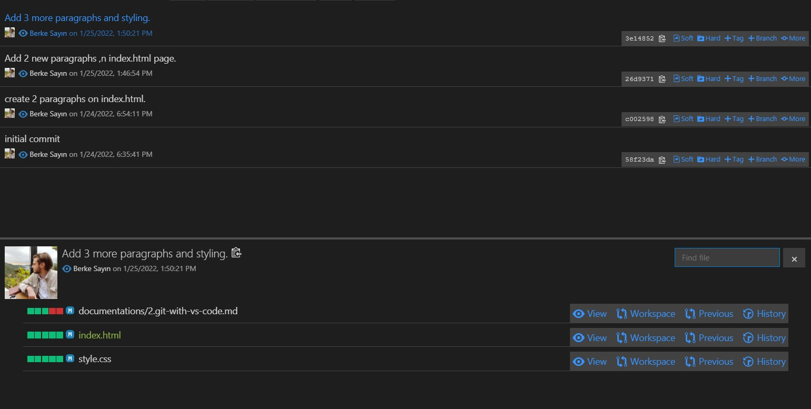 

Aynı zamanda seçilen commiti biz sol tarafta bulunan explorer'daki COMMITS kısmından da görüntüleyip oradan da açabiliriz. 

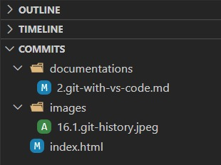 

Ayrıca herhangi bir commiti seçince o commitle birlikte değişiklik yapılan tüm dosyaları görüntüleyebiliyoruz demiştik. 
Bir de değişiklik yapılan dosyalarda neler değişmiş, önceki hali neydi, sonraki hali ne olmuş gibi ayrıntılı incelemek için de 
View, Workspace, Previous, History alanlarından inceleme yapabiliriz.

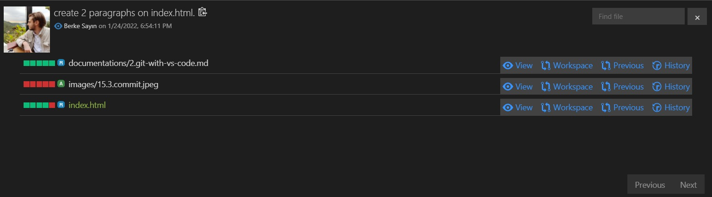 

Ayrıca orada bulunan search bar'dan istediğimiz commiti arama yapabiliriz veya Authors kısmından da istediğimiz kişi 
tarafından oluşturulan commitleri görüntüleyebiliriz.

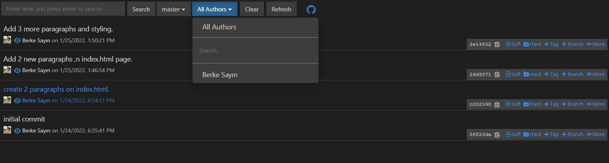 

## Git History İle Commit Geçmişini Görüntüleme 
Peki projenin geçmişi ile ilgili bir history nasıl göreceğiz? Biz herhangi bir dosyadaki commit geçmişini ve history 
yapısını görmüştük, şimdi ise projenin history'sini görmek istiyoruz. Bunun için ister Git History eklentisini kullanabiliriz, 
istersek de Git Lens eklentisini kullanabiliriz. Burada da Git Lens eklentisini göstermek istiyorum.

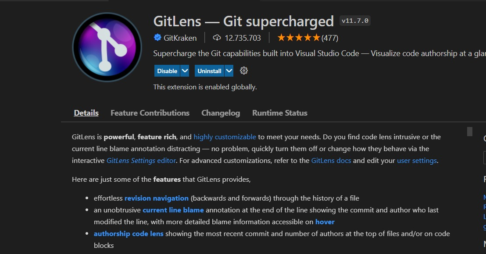 

Bu eklentiyi indirince sol tarafta bulunan nav-bar'da bir Git Lens shortcut'ı ekleniyor.

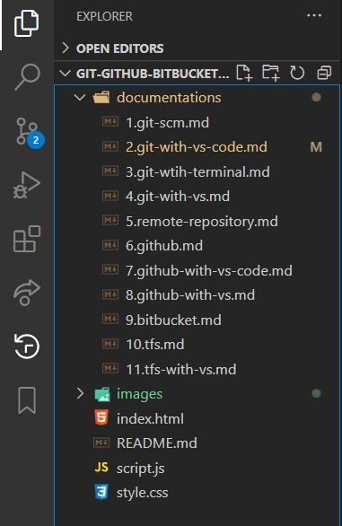 

Burada File History, Branches, Commits, Remotes, Stashes, Tags, Search & Compare alanlarından projenin geçmişini, tüm 
commitleri ve proje ile ilgili adımları ayrıntılı inceleyebiliriz.

 
## Diff İle Farklılıkların Görüntülenmesi 
Bir diğer ihtiyacımız ise yapılan commitlerin içerisindeki dosyaları karşılaştırmak yani aradaki farkları görmek istememizdi. 
Burada index.html sayfasına gidelim ve herhangi bir commitimizi ele alalım. 

Örneğin o commit içerisinde değiştirilen dosyalardan index.html'i ele alaım. Burada eğer View'a tıklarsak index.html dosyasının o commit'teki içeriğini görebiliriz. Eğer burada workspace'e basarsak biz index.html'in o committeki hali ile şu anki en son hali arasındaki farkları görebiliriz. History'ye basarsak eğer o dosyanın bütün commit geçmişini görebiliriz. 

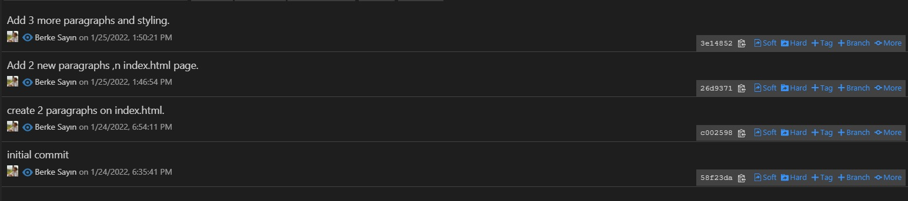

Örneğin burası index.html dosyasının commmit geçmişi. Mesela biz buradaki herhangi 2 commiti birbiryle karşılaştırmak isteyelim.
Örneğin en üstteki commit ile(3e14852) en aşağıdaki commiti(58f23da) birbiri ile karşılaştıralım

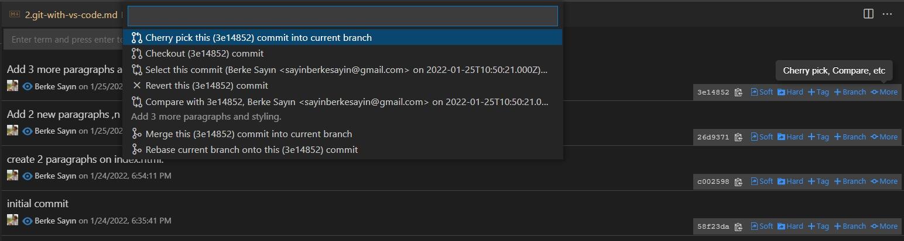

Bunun için en üstteki commitin en sağında bulunan more kısmına basarız ve search bar'da yapmak istediğimiz işlemi seçeriz. Burada Select this commit kısmını seçeriz.

Daha sonra ise en aşağıdaki commitin en sağında bulunan more kısmına basarız ve oradan da Compare with ile başlayan ifadeyi seçeriz. 

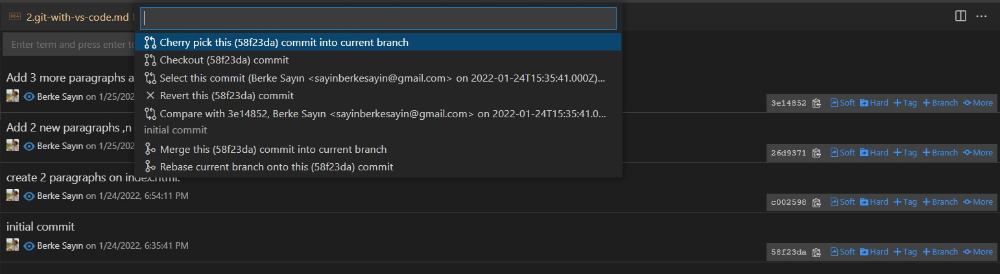

Böylece 2 commit arasındaki farkı görebilmemiz için sağ tarafta bulunan explorer kısmında Compare Commits alanında 
aralarında fark olan dosyaları görebiliriz.

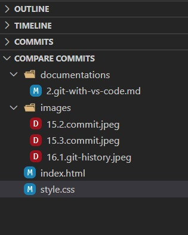

Böylece Git History bölümüü kullanarak commitler arasındaki farkları da ayrıntılı bir şekilde görebiliriz.
## Discard Changes İle Değişikliklerin İptal Edilmesi 
Peki yaptığımız değişiklikleri nasıl iptal ederiz, bu önemli bir konu. Çünkü projemizde çalışırken farklı konular deneyeceğiz, bazen projeyi geliştirirken eklediğimi bir şeylerden dolayı projemiz bozulabilir ya da ortalık karışabilir. Dolayısıyla iptal etme durumlarımızda söz konusu olabilir. 

Örneğin index sayfasına bir tane buton ekleyelim, javascript dosyasına da bir şeyler yazalım ve css dosyasında değişiklik yapalım.

Şu anda index.html, script.js ve style.css dosyalarında değişiklikler yaptık. Bu değişiklikleri sol taraftaki menüde bulunan source kontrol alanımız görecek. Bu değişiklikleri iptal etmek için sol taraftaki source kontrol alanından Discard All Changes dersek, yaptığımız o değişikliklerin hepsi gördüğümüz gibi kaybolacaktır. 

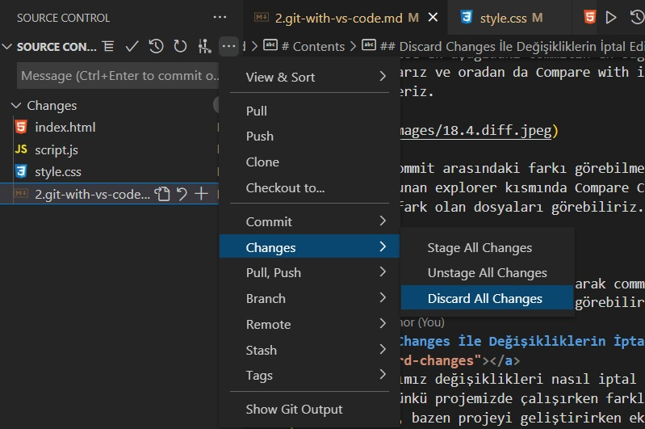

Bu işlemle sadece index.html dosyasında yapılan değişikliği geri alırız. 

Yani Discard All Changes yaparak bütün değişiklikleri commit etmeden geri alabiliriz. 

Ayrıca diyelim ki sadece index.html sayfasında yapılan değişikliği geri almak istiyoruz. Bu durumda source kontrol alanında index.html dosyası üzerinde sağ tıklarız ve Discard Changes deriz, böylece sadece o dosyada yapılan değişikikler geri alınmış olur.

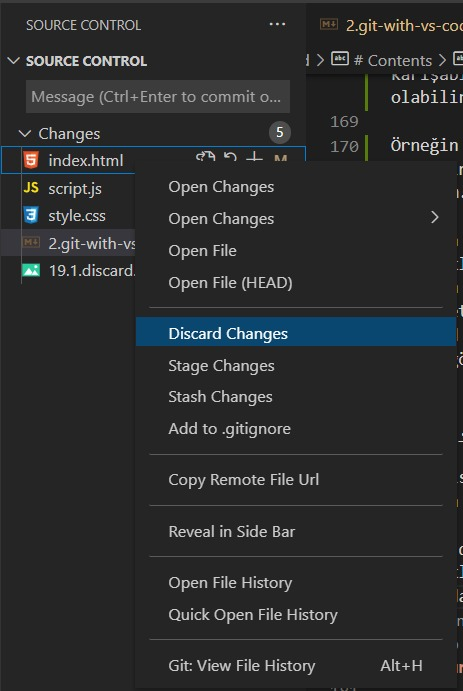

## Undo Last Commit İle Son Commit'e Geri Dönmek 
Bir önceki örnekte değişiklikleri iptal etmeyi gördük. O işlem; daha değişiklikleri commit etmeden geri alabilmeyi sağlıyordu. Peki ya biz yaptığımız değişikliği commit ettiysek, o durumda nasıl geri alırız?

Şimdi Git History'yi açalım. Bunun için VS Code'da en üstteki menü-bar'dan View - Command Palette'yi seçelim. 

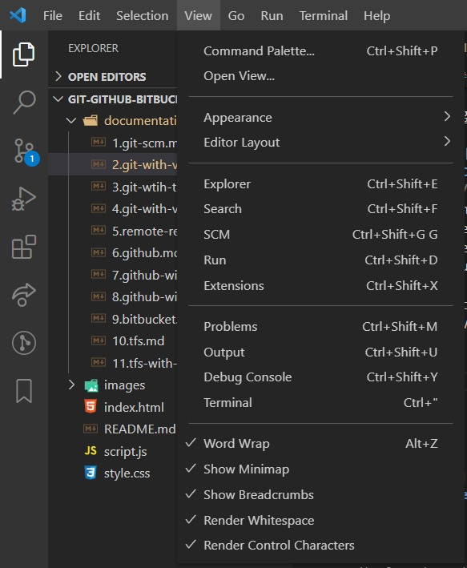

Açılan search bar'a Git: View File History'yi seçelim.

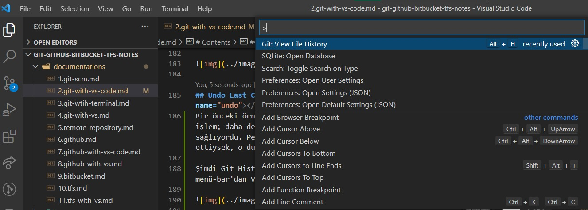

Burada Git: View File History seçili dosyanın geçmişini görüntülemeye yararken, Git: View History (git log) bütün projenin geçmişini görmemizi sağlıyor.

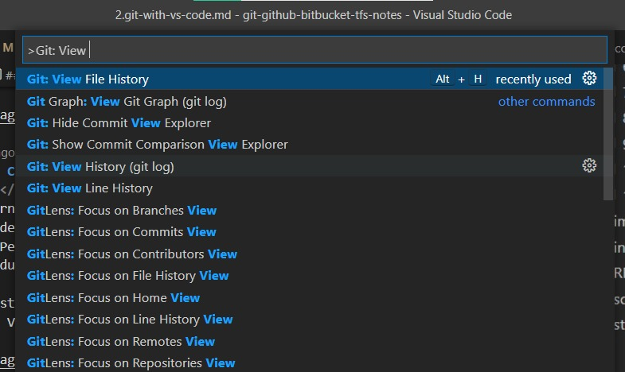

Git: View History ile projenin en başından en sonuna kadar yaptığımız bütün komutları ve değişiklikleri görebiliyoruz. Burada yapılan bütün commitlerin içeriğini de üzerine tıklayarak görebiliyoruz.

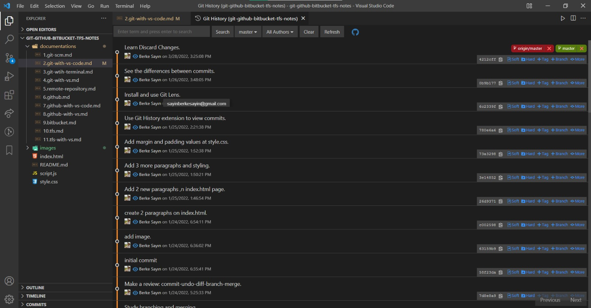

Şimdi burada index.html sayfasına yeni bir paragraf ekleyeyip commit edelim. 

Son commit'imizin adı görüldüğü gibi "Add one paragraph." Şimdi bu commit işlemini geri almak için Source Kontrol alanında bulunan 3 noktadan Undo Last Commit seçeneğini seçeriz.

Bu işlemi yaptıktan sonra son commit geri alındı ve o committe yapılan değişiklikler de commit edilmemiş şekilde source kontrol alanında gösteriliyor. Bu şekilde o commiti geri alabiliriz ve istersek o değişiklikleri bir daha commit edebiliriz. Veya bir daha Undo Last Commit dersek o zaman da en son commiti yine geri alacaktır. 

Yani diyelim ki üst üste 2 sefer Undo Last Commit dedik. Bu durumda 2 commit'i de geri alır. Yapılan değişiklikler gösterilmeye devam eder. İstersek de o değişiklikleri tek bir commit olarak da atabiliriz. 

Bu şekilde commitleri geri alabiliriz. Yanlış bir işlem yaptığımızda veya 2 commiti birleştirip tekrar bir commit olarak atmak istediğimizde bu işlemi kullanırız.   

Kavram olarak biraz karışık gibi gelebilir. Ama aslında değil, her bastığımızda bir geri gidiyoruz. Ama yaptığımız o andaki değişiklikler hala son haliyle ilgili dosyada tutulmaya devam ediyor.

Bu şekilde istediğimiz kadar geriye alma işlemi yaparak, ister commitleri birleştiririz istersek de commitleri tamamen silip bir önceki haline dönebiliriz. 

## Revert İşlemi İle Commit Geri Alma 
Şimdi ise Revert işlemi nedir, ne yapıyor bundan bahsedelim. Revert ile belli bir commiti geri alabiliyoruz. Yani burada o commite geri dönmüyoruz, yapılmış olan o commiti geri almak, yok saymak, orada yapılan işlemi geri al, o işlemi iptal et, o kısımdaki commiti iptal et demek.

Bu durumda o commit olduğu yerde duruyor. Fakat revert işlemi yapılan ayrı bir commit yapılıyor projeye. Eğer çakışmamız yoksa ve hata almıyorsak, yeni commitle beraber, o commit içerisindeki işlemler projeden kaldırılıyor. Şimdi uygulamalı olarak deneyelim. 

index.html dosyamıza 2 tane yeni paragraf ekleyelim.

Daha sonra index.html dosyamızda yaptığımız bu işlemi commitleyelim. 

Şimdi de yine index.html'de 3 tane buton ekleyelim.

Bu işlemi de commitleyelim.

Son olarak bir de index.html'de 4 tane h3 elementi ekleyelim ve bu işlemi de commitleylim.

Şu anda Git History'ye baktığımız zaman yaptığımız son 3 commit işlemini de görebiliriz. 

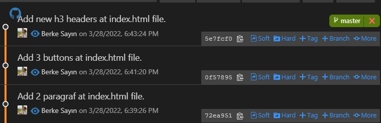

Burada yine commitlerin üzerine tıklayarak her biri ile hangi işlemleri yaptığımızı görebiliriz.

Burada şimdi revert işlemi ile commitleri geri alacağız. 

Revert işlemlerini çakışma olmaması için(best-practice kapsamında) son committen başlayarak yapmakta fayda var. Çakışma olursa eğer o çakışmaların kaldırılması, çözülmesi(resolve) gerekiyor. 

Şimdi en son yaptığımız commitin adı: "Add new h3 headers at index.html file" dı. Şimdi Git View Histroy File diyelim.

Burada revert işlemini yapmak istediğimiz commit için en sağda bulunan more ifadesini seçelim ve açılan search bar'dan "revert this commit" seçeneğine tıklayalım.

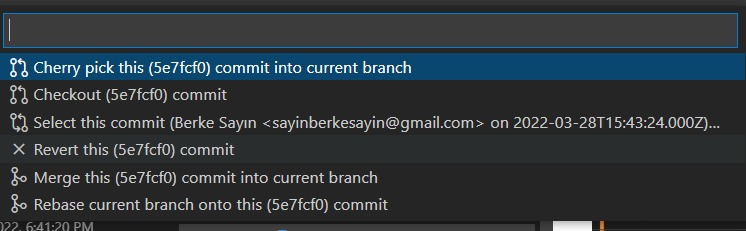

Revert işlemini onayladıktan sonra "Add new h3 headers at index.html file" commitinde yapılan işlemler geri alınarak yeni bir commit oluşturulur, yani o commit direk silinmez, o committe yapılan değişikliklerin geri alındığı yeni bir commit işlemi gerçekleşir.

Yani biz o commit ile 4 tane h3 elementi eklemiştik. O eklediğimiz elementlerin kaldırılma işleminin gerçekleştiği Revert ... isimli commit oluşturulur. 

Revert commitinin adı da otomatik olarak:
"Revert Add new h3 headers at index.html file" olur.

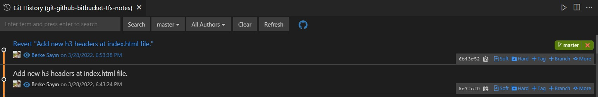

Revert işlemini gerçekleştirme aşamasında önemli olan nokta en sondan geriye doğru gitmektir. Böylece yapılan işlemlerde çakışma olması engellenerek, hatanın önüne geçilir. 

Eğer ki üstteki commiti revert etmeden bir alttakini revert edersek, o zaman bize bir çakışma durumu olacaktı, çünkü yok etmeye çalıştığımız satır üstteki committe mevcut, bu durumda bu çakışmayı(sorunu) manuel olarak çözmemiz gerekecekti. Bunu daha ayrıntılı olarak Conflict(Çakışma) bölümünde göreceğiz. 

İşte bu sebeple Revert işleminde geriye doğru adım adım gitmek çok önemli. Geriye doğru adım adım gidersek, birbirlerine olan bağımlıklıları da kalkacaktır. 

## Staged ve Unstaged İşlemleri 

Proje geliştirme sürecinde duyduğumuz ihtiyaçlardan bir diğeri ise yapacağımız commitleri, örneğin geliştirmekte olduğumuz bazı kodlar oldu ve bu kodları parçalayarak 2 farklı commit olarak atmak istiyoruz. Ama Visual Studio Code bunu tek değişim olarak görüyor, commitlemeye çalışıyor gibi düşünebiliriz. Halbuki bir commiti yaparken bütün dosyaları her zaman commit etmek zorunda değiliz. Yazdığımız kodları parçalayarak ilk önce bu kısımları commit et, daha sonra şu kısımları commit et diyebiliriz. Bu tamamen bizim elimizde. 

Örneğin script.js'ye kodlar ekleyelim ve style.css'te body'nin color'ını blue yapalım. Burada normalde yapmamız gerekenden fazla kodladığımızı varsayalım. Ve şu anda da bunları 2 ayrı commit olarak atmak istediğimizi varsayalım. Yarın ileride geri alırken parçalı şekilde almak isteyebiliriz veya script kodları ayrı bir görevin bütünüydü, style kodları da farklı görevleri yerine getiriyordu. Bu sebeple onları farklı commit olarak atmak isteyebiliriz. Görev olarak düşünüp commit etmemiz gerekli. 

Şu an yaptığımız değişiklikler source kontrol alanında değişiklik olarak algılanmış şekilde. Fakat bu değişiklikleri commit ederken ilk önce "Staged Area" ya alıyoruz. Ondan sonra commit gerçekleşiyordu. Eğer hemen sol tarafta bulunan alanda mesaj kutusuna mesajı yazıp butona basarsak, bütün değişiklikleri otomatik olarak Staging Area'ya alayım mı diyecek, ve daha sonra hepsini bir olarak commitleyecek.

Bu durumda eğer mesajı yazıp butona basarsak önce bütün değişiklikleri otomatik olarak staging area'ya alır ve oradan da hepsini bir commit eder. 

Fakat biz script.js'i ve style.css'i ayrı ayrı commit etmek istiyoruz diyelim. O durumda önce script.js'nin yanındaki + butonuna basıp onu öncelikle staging area'ya alırız. 

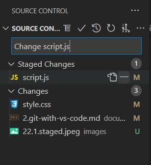

Daha sonra da script.js için yapılan değişikliğin commit mesajını yazıp commitleriz. Bu durumda script.js önce staging area'ya alınmış daha sonra da commitlenmiş oldu.

Fakat style.css te yapılan değişiklikler hala staging area'ya alınıp commitlenmedi, hala working directory'de duruyor. Aynı işlemi style.css için de yapalım. İlk önce style.css in yanında bulunan + butonuna basıp onu staging area'ya alalım. Daha sonra da commit mesajını yazıp commitleyelim.

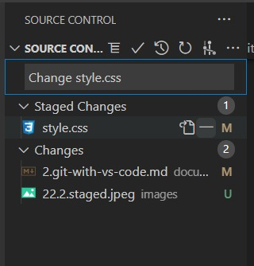

Böylece script.js ve style.css için yazmış olduğumuz kodları 2 farklı commit şeklinde ayrı ayrı gerçekleştirdik. 

## Commit Amend ve Signed Off Mantığı 

Şimdi de commit amend ve commit signed off ifadelerine değinelim. Source kontrol bölümünde bir şeyleri commitlemeden önce veya başka işlemlerimizi yapmadan önce commit all diyerek bütün değişiklikleri commitlemeyi görmüştük. 

Commit All diyince otomatik olarak değişiklikleri önce Staging Area'ya alıp ardından commit ederdi. 

Bir de Commit All(Amend) isimli bir komutumuz var. Bu komut ise son yapılan commit üzerinde değişiklik yapmayı sağlıyor ve commit mesajını da update edebilmemize olanak sağlıyor. Son yapılan commit üzerine yeni yapılan değişikliği yazıyor ve mesajı da düzenleyebilmemizi sağlıyor. 

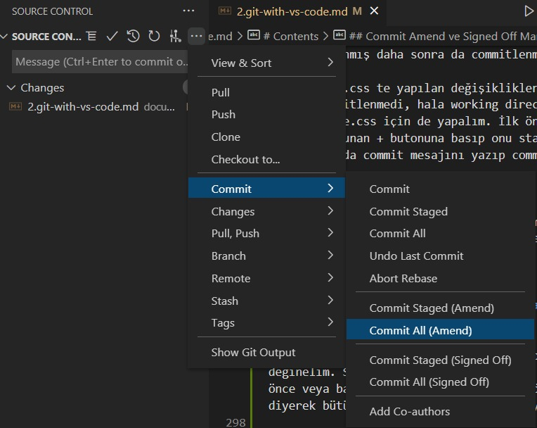

Bu şekilde soruce kontrol alanından 3 noktaya tıklayarak bu komutu seçebiliriz.

Commit All(Signed Off) ise çoğu zaman çoğu yazılım geliştirme ortamında aslında kullanılmayan bir şey, linux kernel ile alakalı, linux üzerinde geliştirme yapanların kullandığı bir komut ve Signed Off ile yaptığımız bir commiti bir kişi tarafından imzalanmasını sağlamış oluyoruz. Yani şu kişi tarafından bu commit imzalanmıştır şeklinde bir ifade düşürüyor commitin yanına, ekstra farklı bir durum söz konusu değil, bu da o kişi ile alakalı, o komutun sahibinin veya sorumlusunun o kişi olduğu veya bazı yasal-lisansal gereklilikleri imzalamak için kullanılan, ve daha çok linux-kernel üzerinde yapılan değişikliklerde kullanılan bir komut(commitleme yöntemi). Yani bir imzalama söz konusu. Kişinin ismiyle imzalıyor. Bunu gerekli gören bazı platformlar var linux-kernel gibi, işte o durumlarda kullanılıyor. Dolayısıyla onun dışında çoğu zaman kullanılmayan bir commitleme yöntemi.

Şimdi index.html dosyamıza table ekleyelim ve o işlemi commitleyelim.

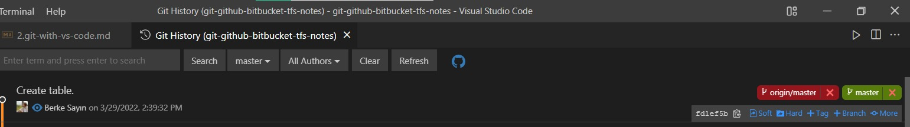

Gördüğümüz üzere "Create table" isimli commitimiz oluştu.

Peki şimdi de bir commit amend'e bakalım. Bunun için index.html dosyamıza table içerisinde yeni table datası ekleyelim.

Şimdi bu değişiklik için commit amend'i kullanacağız. amend, az önce de dediğimiz gibi son commiti ezer, yaptığımız değişikliği yine son commitin üzerine yazar. Ve o değişiklikler de son committe yapılmış gibi gözükür. Yani bir nevi update etmek gibi düşünebiliriz. Şimdi yeni commit mesajı ile commit amendi kullanalım.

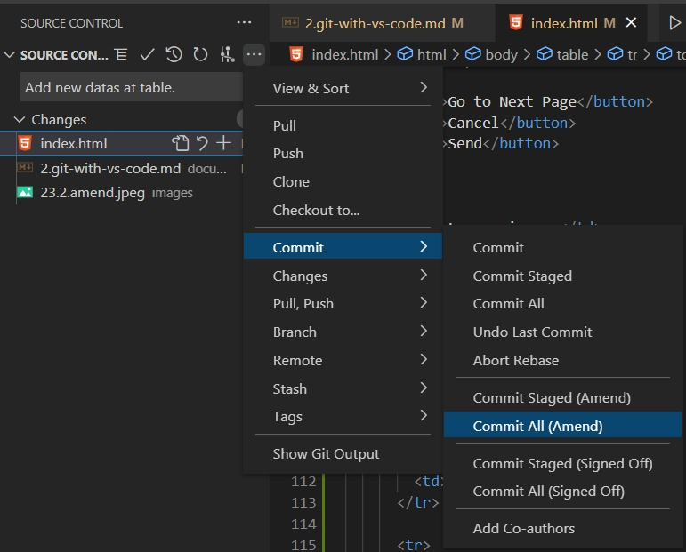

Böylelikle commit amend ile son commit güncellendi. Yeni eklenen değişiklikler de son commitin içerisinde dahil edildi ve commit mesajı en son yazdığımız mesaj oldu. 

Bu şekilde unuttuğumuz şeyleri ekleyebiliriz ve mesajı da güncelleyebiliriz. 

## Stash İle Değişiklikleri Saklamak 

## Stash'deki Değişiklikleri Uygulama, Silme ve Değiştirme 

## Branch Oluşturma ve Merge İşlemleri 

## Git History İle Branch Oluşturma 

## Conflict(Çakışma) Yönetimi 

## Tag(Etiket) Kullanımı 

## Ignore Dosyaları Önemi ve Kullanımı 

