# Visual Studio Code ile Git Kullanımı 

# Contents
* [Commit İşlemi ve Yapısı](#commit)
* [Git History İle Dosya Geçmişini Görüntüleme](#git-history-file)
* [Git History İle Commit Geçmişini Görüntüleme](#git-history-commit)
* [Diff İle Farklılıkların Görüntülenmesi](#diff)
* [Discard Changes İle Değişikliklerin İptal Edilmesi](#discard-changes)
* [Undo Last Commit İle Son Commit'e Geri Dönmek](#undo)
* [Revert İşlemi İle Commit Geri Alma](#revert)
* [Staged ve Unstaged İşlemleri](#staged-unstaged)
* [Commit Amend ve Signed Off Mantığı](#amend-signed-off)
* [Stash İle Değişiklikleri Saklamak](#git-stash)
* [Stash'deki Değişiklikleri Uygulama, Silme ve Değiştirme](#stash-changes)
* [Branch Oluşturma ve Merge İşlemleri](#branch-merge)
* [Git History İle Branch Oluşturma](#git-history-branch)
* [Conflict(Çakışma) Yönetimi](#conflict)
* [Tag(Etiket) Kullanımı](#tag)
* [Ignore Dosyaları Önemi ve Kullanımı](#ignore)

## Commit İşlemi ve Yapısı 

- Proje geliştirme sürecinde git ile çalışırken amacımız versiyonlamak. Proje geliştirme süreci boyunca hangi kod editörü veya IDE kullanırsak kullanalım amacımız versiyonlamak, projenin farklı versiyonlarını elde edebilmek, geriye dönebilmek ve uygulamayı südürülebilir, geliştirilebilir hale getirmek. Şimdi de Visual Studio Code ile bunu deneyelim. 

- Visual Studio Code'da proje klasörümüzü açtıktan sonra üzerinde çalışmak için örnek olarak; index.html, style.css ve script.js dosyalarını oluşturalım. Biz önceden "Initialize Repository" diyerek zaten Git'i eklemiştik ve "Publish On Github" diyerek de proje klasörümüzü github'da paylaşmıştık. Yani bu işlemlerden sonra bu klasör git tarafından kontrol ediliyor. Klasör yapımız içerisine baktığımızda .git klasörünü görürüz. Yani bu klasör git tarafından yönetiliyor demek. 

- Projeye Git'i ekledikten sonra da commit mantığına bakalım. Git ile commit yapısının biraz daha detaylandırılması gerekiyor. Commit aslında neleri içeriyor, commit işlemi aslında ne ve bize ne sağlıyor, buna bakalım. 

Üzerinde çalıştığımız proje klasörü yani Git'e eklediğimiz klasör aslında bizim "Working Directory" dediğimiz klasör, yani git buna "Working Directory" diyor, yani çalışma klasörü. İçerisinde de bizim projemizin dosyaları var. Biz commit işlemi yapmak istediğimizde aslında ilk olarak bunun 
`Staging Area` denen ara katmana eklenmesi gerekiyor. Bu işlemi de yaparken git'de bulunan add komutunu kullanıyoruz. Bunu VS Code 
üzerinde yazdığımız komut gerçekleştiriyor. Ve add komutu ile ilgili değişikliklerin olduğu dosyalar ilk olarak staging area'ya 
alınıyor. Burada derlenir indexlenir. Ardından commit işlemi gerçekleştirilerek local repository'ye kalıcı bir versiyonlama 
oluşturulur. Yani o anki değişiklikler artık commit'lenmiştir, onaylanmış, kaydedilmiştir. Numaralandırılarak commit işlemi 
gerçekleştirilir. 

Yani bir commit aslında 2 aşamadır. İlk önce değişiklikleri add komutu ile staging area'ya ekleme ve sonra değişikliklerin local
repository'ye commit edilmesi. Local repository dediğimiz şey de aslında veri tabanı diyebiliriz. Değişikliklerin git'in 
veri tabanına eklenmesi. 

Geri alma işlemlerinde ise 2 tür geri almamız söz konusudur. Birincisi daha commit etmeden, yani staging area'ya aldığımız verilerin
geri alınması, yani üzerinde çalıştığımız klasörde bir şeyler değiştirdik, o değişiklikleri add komutu ile staging area'ya aldık, 
işte oradan geriye Reset komutuyla unstage ederek tekrar o değişiklikleri iptal edip çalışma klasörümüze geri döndürebiliriz. 
Bu sefer değişiklikleri geri almış oluruz. Yani projeyi bozduğumuzu düşünnüyoruz ya da beklenmedik şeyler oldu, yaptığımız tüm 
değşiklikleri daha hiç commit etmeden reset komutuyla geri alabiliriz. 

Ama eğer değişiklik yapıp staging area'ya da ekledikten sonra commitlediysek ve geri almak istiyorsak bu sefer de Reset Commit
işlemi yani Undo Last Commit dediğimiz bu undo işlemi yaparak bir önceki versiyona geri dönme işlemini yapabiliriz. 

Yani staging kısmından ya da commitlenmiş repository'den geriye dönme şansımız söz konusu. Şimdi bu işlemleri VS Code üzerinde
deneyelim. Sol tarafta bulunan navigasyon bar'da Source Control alanını seçip git kısmına gelebiliriz. 

Yine o kısımda yapılan değişiklikleri önce Changes'ın yanında bulunan + işaretiyle staging area'ya alabiliriz. Ardından orada 
bulunan bar'a yapılan değişiklikleri açıklayan mantıklı bir açıklama ifadesi yazarız ve en son da o mesaj barının üzerinde bulunan
tik işaretiyle commitleriz.

Burada yapılan commit'lerin anlamlı olması gerekir. Yani bir görevi bitirdikten sonra o görevi, değişiklikleri belirten 
bir commit mesajı ile commit yapılmalıdır. Biz buradaki değişiklikleri initial commit diye açıklayarak kaydedebiliriz. Bir 
proje içerisinde gerekli dosyalar oluşturulduktan sonra genelde ilk commit bu şekilde adlandırılır. 

Örneğin index.html dosyamıza 2 tane paragraf ekleyelim. (2 tane p elementi)

Burada Changes altında değiştirilen dosyaları görebiliriz ve artık burada index.html yanında U(untracked) yazmaz, M(Modified) yazar çünkü biz bir sefer o dosyayı tracked konumuna yani izlemeye aldık. Yine burada + ile değişiklikleri staged konumuna alabiliriz ve ardından mesajımızı yazıp commitleyebiliriz. 
## Git History İle Dosya Geçmişini Görüntüleme 
Bu bölümde ise commit'lerimiz arasında nasıl gezeceğiz, commtitleri nasıl görüntüleyeceğiz ve aralarındaki farkları nasıl
görecğiz, bu konulara değinelim. Bunun için bir Visual Studio Code extension'ından(eklenti) faydalanacağız. VS Code üzerinde 
extensions kısmına geçip oradaki search kısmında Git History yazalım ve açılan eklentiyi indirelim.

 

Git History eklentisi aracılığıyla biz commitlerimizin geçmişini görüntüleybileceğiz. 

Bu eklentiyi kurduktan sonra şimdi projemizde commitler yapalım. index.html sayfamıza 2 yeni paragraf ekleyebiliriz. Daha sonra ise "Add 2 new paragraphs in index.html page." isimli bir commit mesajıyla commit yapabiliriz.

Ardından yeni commitler de görmek adına yine 3 yeni paragraf ekleyelim ve bu sefer de ayrıca style.css dosyasında değişiklikler yapalım. En son da bu değişiklikleri yine commitleyelim. 

Şimdi de style.css'e gidip padding'e ve margin'e 0 verelim ve bu değişikliği de commit yapalım.

Amacımız burada projede farklı değişikliklerin olduğu farklı commitler gerçekleştirmekti. Bunu yaptık. Şimdi ise Git History
eklentisi ile bu commitleri inceleyeceğiz. 

Biz Git History ile projemiz üerindeki herhangi bir dosyanın tüm commit geçmişlerini görüntüleyebiliyoruz. Onun için sol tarafta
dosyayı seçtikten sonra üzerinde sağ tıklayıp Git: View File History demeliyiz.

 

Git: View File History'ye basınca bize o dosyanın geçtiği tüm commitleri listeliyor olacak. 

 

Burada herhangi bir commit'i de seçersek o commit içerisindeki değişikliğe uğarmış dosyaları görebiliriz. O commitin kimin tarafından
hangi tarihte, hangi saatte yapıldığını görebiliriz ve burada o commitle hangi dosyalarda değişiklik olduğuyla beraber kaç adet 
değişiklik olduğunu da görebiliriz. 

 

Aynı zamanda seçilen commiti biz sol tarafta bulunan explorer'daki COMMITS kısmından da görüntüleyip oradan da açabiliriz. 

 

Ayrıca herhangi bir commiti seçince o commitle birlikte değişiklik yapılan tüm dosyaları görüntüleyebiliyoruz demiştik. 
Bir de değişiklik yapılan dosyalarda neler değişmiş, önceki hali neydi, sonraki hali ne olmuş gibi ayrıntılı incelemek için de 
View, Workspace, Previous, History alanlarından inceleme yapabiliriz.

 

Ayrıca orada bulunan search bar'dan istediğimiz commiti arama yapabiliriz veya Authors kısmından da istediğimiz kişi 
tarafından oluşturulan commitleri görüntüleyebiliriz.

 

## Git History İle Commit Geçmişini Görüntüleme 
Peki projenin geçmişi ile ilgili bir history nasıl göreceğiz? Biz herhangi bir dosyadaki commit geçmişini ve history 
yapısını görmüştük, şimdi ise projenin history'sini görmek istiyoruz. Bunun için ister Git History eklentisini kullanabiliriz, 
istersek de Git Lens eklentisini kullanabiliriz. Burada da Git Lens eklentisini göstermek istiyorum.

 

Bu eklentiyi indirince sol tarafta bulunan nav-bar'da bir Git Lens shortcut'ı ekleniyor.

 

Burada File History, Branches, Commits, Remotes, Stashes, Tags, Search & Compare alanlarından projenin geçmişini, tüm 
commitleri ve proje ile ilgili adımları ayrıntılı inceleyebiliriz.

 
## Diff İle Farklılıkların Görüntülenmesi 
Bir diğer ihtiyacımız ise yapılan commitlerin içerisindeki dosyaları karşılaştırmak yani aradaki farkları görmek istememizdi. 
Burada index.html sayfasına gidelim ve herhangi bir commitimizi ele alalım. 

Örneğin o commit içerisinde değiştirilen dosyalardan index.html'i ele alaım. Burada eğer View'a tıklarsak index.html dosyasının o commit'teki içeriğini görebiliriz. Eğer burada workspace'e basarsak biz index.html'in o committeki hali ile şu anki en son hali arasındaki farkları görebiliriz. History'ye basarsak eğer o dosyanın bütün commit geçmişini görebiliriz. 

Örneğin burası index.html dosyasının commmit geçmişi. Mesela biz buradaki herhangi 2 commiti birbiryle karşılaştırmak isteyelim.
Örneğin en üstteki commit ile(3e14852) en aşağıdaki commiti(58f23da) birbiri ile karşılaştıralım

Bunun için en üstteki commitin en sağında bulunan more kısmına basarız ve search bar'da yapmak istediğimiz işlemi seçeriz. Burada Select this commit kısmını seçeriz.

Daha sonra ise en aşağıdaki commitin en sağında bulunan more kısmına basarız ve oradan da Compare with ile başlayan ifadeyi seçeriz. 

Böylece 2 commit arasındaki farkı görebilmemiz için sağ tarafta bulunan explorer kısmında Compare Commits alanında 
aralarında fark olan dosyaları görebiliriz.

Böylece Git History bölümüü kullanarak commitler arasındaki farkları da ayrıntılı bir şekilde görebiliriz.
## Discard Changes İle Değişikliklerin İptal Edilmesi 
Peki yaptığımız değişiklikleri nasıl iptal ederiz, bu önemli bir konu. Çünkü projemizde çalışırken farklı konular deneyeceğiz, bazen projeyi geliştirirken eklediğimi bir şeylerden dolayı projemiz bozulabilir ya da ortalık karışabilir. Dolayısıyla iptal etme durumlarımızda söz konusu olabilir. 

Örneğin index sayfasına bir tane buton ekleyelim, javascript dosyasına da bir şeyler yazalım ve css dosyasında değişiklik yapalım.

Şu anda index.html, script.js ve style.css dosyalarında değişiklikler yaptık. Bu değişiklikleri sol taraftaki menüde bulunan source kontrol alanımız görecek. Bu değişiklikleri iptal etmek için sol taraftaki source kontrol alanından Discard All Changes dersek, yaptığımız o değişikliklerin hepsi gördüğümüz gibi kaybolacaktır. 

Bu işlemle sadece index.html dosyasında yapılan değişikliği geri alırız. 

Yani Discard All Changes yaparak bütün değişiklikleri commit etmeden geri alabiliriz. 

Ayrıca diyelim ki sadece index.html sayfasında yapılan değişikliği geri almak istiyoruz. Bu durumda source kontrol alanında index.html dosyası üzerinde sağ tıklarız ve Discard Changes deriz, böylece sadece o dosyada yapılan değişikikler geri alınmış olur.

## Undo Last Commit İle Son Commit'e Geri Dönmek 
Bir önceki örnekte değişiklikleri iptal etmeyi gördük. O işlem; daha değişiklikleri commit etmeden geri alabilmeyi sağlıyordu. Peki ya biz yaptığımız değişikliği commit ettiysek, o durumda nasıl geri alırız?

Şimdi Git History'yi açalım. Bunun için VS Code'da en üstteki menü-bar'dan View - Command Palette'yi seçelim. 

Açılan search bar'a Git: View File History'yi seçelim.

Burada Git: View File History seçili dosyanın geçmişini görüntülemeye yararken, Git: View History (git log) bütün projenin geçmişini görmemizi sağlıyor.

Git: View History ile projenin en başından en sonuna kadar yaptığımız bütün komutları ve değişiklikleri görebiliyoruz. Burada yapılan bütün commitlerin içeriğini de üzerine tıklayarak görebiliyoruz.

Şimdi burada index.html sayfasına yeni bir paragraf ekleyeyip commit edelim. 

Son commit'imizin adı görüldüğü gibi "Add one paragraph." Şimdi bu commit işlemini geri almak için Source Kontrol alanında bulunan 3 noktadan Undo Last Commit seçeneğini seçeriz.

Bu işlemi yaptıktan sonra son commit geri alındı ve o committe yapılan değişiklikler de commit edilmemiş şekilde source kontrol alanında gösteriliyor. Bu şekilde o commiti geri alabiliriz ve istersek o değişiklikleri bir daha commit edebiliriz. Veya bir daha Undo Last Commit dersek o zaman da en son commiti yine geri alacaktır. 

Yani diyelim ki üst üste 2 sefer Undo Last Commit dedik. Bu durumda 2 commit'i de geri alır. Yapılan değişiklikler gösterilmeye devam eder. İstersek de o değişiklikleri tek bir commit olarak da atabiliriz. 

Bu şekilde commitleri geri alabiliriz. Yanlış bir işlem yaptığımızda veya 2 commiti birleştirip tekrar bir commit olarak atmak istediğimizde bu işlemi kullanırız.   

Kavram olarak biraz karışık gibi gelebilir. Ama aslında değil, her bastığımızda bir geri gidiyoruz. Ama yaptığımız o andaki değişiklikler hala son haliyle ilgili dosyada tutulmaya devam ediyor.

Bu şekilde istediğimiz kadar geriye alma işlemi yaparak, ister commitleri birleştiririz istersek de commitleri tamamen silip bir önceki haline dönebiliriz. 

## Revert İşlemi İle Commit Geri Alma 
Şimdi ise Revert işlemi nedir, ne yapıyor bundan bahsedelim. Revert ile belli bir commiti geri alabiliyoruz. Yani burada o commite geri dönmüyoruz, yapılmış olan o commiti geri almak, yok saymak, orada yapılan işlemi geri al, o işlemi iptal et, o kısımdaki commiti iptal et demek.

Bu durumda o commit olduğu yerde duruyor. Fakat revert işlemi yapılan ayrı bir commit yapılıyor projeye. Eğer çakışmamız yoksa ve hata almıyorsak, yeni commitle beraber, o commit içerisindeki işlemler projeden kaldırılıyor. Şimdi uygulamalı olarak deneyelim. 

index.html dosyamıza 2 tane yeni paragraf ekleyelim.

Daha sonra index.html dosyamızda yaptığımız bu işlemi commitleyelim. 

Şimdi de yine index.html'de 3 tane buton ekleyelim.

Bu işlemi de commitleyelim.

Son olarak bir de index.html'de 4 tane h3 elementi ekleyelim ve bu işlemi de commitleylim.

Şu anda Git History'ye baktığımız zaman yaptığımız son 3 commit işlemini de görebiliriz. 

Burada yine commitlerin üzerine tıklayarak her biri ile hangi işlemleri yaptığımızı görebiliriz.

Burada şimdi revert işlemi ile commitleri geri alacağız. 

Revert işlemlerini çakışma olmaması için(best-practice kapsamında) son committen başlayarak yapmakta fayda var. Çakışma olursa eğer o çakışmaların kaldırılması, çözülmesi(resolve) gerekiyor. 

Şimdi en son yaptığımız commitin adı: "Add new h3 headers at index.html file" dı. Şimdi Git View Histroy File diyelim.

Burada revert işlemini yapmak istediğimiz commit için en sağda bulunan more ifadesini seçelim ve açılan search bar'dan "revert this commit" seçeneğine tıklayalım.

Revert işlemini onayladıktan sonra "Add new h3 headers at index.html file" commitinde yapılan işlemler geri alınarak yeni bir commit oluşturulur, yani o commit direk silinmez, o committe yapılan değişikliklerin geri alındığı yeni bir commit işlemi gerçekleşir.

Yani biz o commit ile 4 tane h3 elementi eklemiştik. O eklediğimiz elementlerin kaldırılma işleminin gerçekleştiği Revert ... isimli commit oluşturulur. 

Revert commitinin adı da otomatik olarak:
"Revert Add new h3 headers at index.html file" olur.

Revert işlemini gerçekleştirme aşamasında önemli olan nokta en sondan geriye doğru gitmektir. Böylece yapılan işlemlerde çakışma olması engellenerek, hatanın önüne geçilir. 

Eğer ki üstteki commiti revert etmeden bir alttakini revert edersek, o zaman bize bir çakışma durumu olacaktı, çünkü yok etmeye çalıştığımız satır üstteki committe mevcut, bu durumda bu çakışmayı(sorunu) manuel olarak çözmemiz gerekecekti. Bunu daha ayrıntılı olarak Conflict(Çakışma) bölümünde göreceğiz. 

İşte bu sebeple Revert işleminde geriye doğru adım adım gitmek çok önemli. Geriye doğru adım adım gidersek, birbirlerine olan bağımlıklıları da kalkacaktır. 

## Staged ve Unstaged İşlemleri 

Proje geliştirme sürecinde duyduğumuz ihtiyaçlardan bir diğeri ise yapacağımız commitleri, örneğin geliştirmekte olduğumuz bazı kodlar oldu ve bu kodları parçalayarak 2 farklı commit olarak atmak istiyoruz. Ama Visual Studio Code bunu tek değişim olarak görüyor, commitlemeye çalışıyor gibi düşünebiliriz. Halbuki bir commiti yaparken bütün dosyaları her zaman commit etmek zorunda değiliz. Yazdığımız kodları parçalayarak ilk önce bu kısımları commit et, daha sonra şu kısımları commit et diyebiliriz. Bu tamamen bizim elimizde. 

Örneğin script.js'ye kodlar ekleyelim ve style.css'te body'nin color'ını blue yapalım. Burada normalde yapmamız gerekenden fazla kodladığımızı varsayalım. Ve şu anda da bunları 2 ayrı commit olarak atmak istediğimizi varsayalım. Yarın ileride geri alırken parçalı şekilde almak isteyebiliriz veya script kodları ayrı bir görevin bütünüydü, style kodları da farklı görevleri yerine getiriyordu. Bu sebeple onları farklı commit olarak atmak isteyebiliriz. Görev olarak düşünüp commit etmemiz gerekli. 

Şu an yaptığımız değişiklikler source kontrol alanında değişiklik olarak algılanmış şekilde. Fakat bu değişiklikleri commit ederken ilk önce "Staged Area" ya alıyoruz. Ondan sonra commit gerçekleşiyordu. Eğer hemen sol tarafta bulunan alanda mesaj kutusuna mesajı yazıp butona basarsak, bütün değişiklikleri otomatik olarak Staging Area'ya alayım mı diyecek, ve daha sonra hepsini bir olarak commitleyecek.

Bu durumda eğer mesajı yazıp butona basarsak önce bütün değişiklikleri otomatik olarak staging area'ya alır ve oradan da hepsini bir commit eder. 

Fakat biz script.js'i ve style.css'i ayrı ayrı commit etmek istiyoruz diyelim. O durumda önce script.js'nin yanındaki + butonuna basıp onu öncelikle staging area'ya alırız. 

Daha sonra da script.js için yapılan değişikliğin commit mesajını yazıp commitleriz. Bu durumda script.js önce staging area'ya alınmış daha sonra da commitlenmiş oldu.

Fakat style.css te yapılan değişiklikler hala staging area'ya alınıp commitlenmedi, hala working directory'de duruyor. Aynı işlemi style.css için de yapalım. İlk önce style.css in yanında bulunan + butonuna basıp onu staging area'ya alalım. Daha sonra da commit mesajını yazıp commitleyelim.

Böylece script.js ve style.css için yazmış olduğumuz kodları 2 farklı commit şeklinde ayrı ayrı gerçekleştirdik. 

## Commit Amend ve Signed Off Mantığı 

Şimdi de commit amend ve commit signed off ifadelerine değinelim. Source kontrol bölümünde bir şeyleri commitlemeden önce veya başka işlemlerimizi yapmadan önce commit all diyerek bütün değişiklikleri commitlemeyi görmüştük. 

Commit All diyince otomatik olarak değişiklikleri önce Staging Area'ya alıp ardından commit ederdi. 

Bir de Commit All(Amend) isimli bir komutumuz var. Bu komut ise son yapılan commit üzerinde değişiklik yapmayı sağlıyor ve commit mesajını da update edebilmemize olanak sağlıyor. Son yapılan commit üzerine yeni yapılan değişikliği yazıyor ve mesajı da düzenleyebilmemizi sağlıyor. 

Bu şekilde soruce kontrol alanından 3 noktaya tıklayarak bu komutu seçebiliriz.

Commit All(Signed Off) ise çoğu zaman çoğu yazılım geliştirme ortamında aslında kullanılmayan bir şey, linux kernel ile alakalı, linux üzerinde geliştirme yapanların kullandığı bir komut ve Signed Off ile yaptığımız bir commiti bir kişi tarafından imzalanmasını sağlamış oluyoruz. Yani şu kişi tarafından bu commit imzalanmıştır şeklinde bir ifade düşürüyor commitin yanına, ekstra farklı bir durum söz konusu değil, bu da o kişi ile alakalı, o komutun sahibinin veya sorumlusunun o kişi olduğu veya bazı yasal-lisansal gereklilikleri imzalamak için kullanılan, ve daha çok linux-kernel üzerinde yapılan değişikliklerde kullanılan bir komut(commitleme yöntemi). Yani bir imzalama söz konusu. Kişinin ismiyle imzalıyor. Bunu gerekli gören bazı platformlar var linux-kernel gibi, işte o durumlarda kullanılıyor. Dolayısıyla onun dışında çoğu zaman kullanılmayan bir commitleme yöntemi.

Şimdi index.html dosyamıza table ekleyelim ve o işlemi commitleyelim.

Gördüğümüz üzere "Create table" isimli commitimiz oluştu.

Peki şimdi de bir commit amend'e bakalım. Bunun için index.html dosyamıza table içerisinde yeni table datası ekleyelim.

Şimdi bu değişiklik için commit amend'i kullanacağız. amend, az önce de dediğimiz gibi son commiti ezer, yaptığımız değişikliği yine son commitin üzerine yazar. Ve o değişiklikler de son committe yapılmış gibi gözükür. Yani bir nevi update etmek gibi düşünebiliriz. Şimdi yeni commit mesajı ile commit amendi kullanalım.

Böylelikle commit amend ile son commit güncellendi. Yeni eklenen değişiklikler de son commitin içerisinde dahil edildi ve commit mesajı en son yazdığımız mesaj oldu. 

Bu şekilde unuttuğumuz şeyleri ekleyebiliriz ve mesajı da güncelleyebiliriz. 

Bir de Commit Signed Off'u gösterelim. Bunun için index.html'deki tabloya bir de Sayın Berke data'sını ekleyelim. Daha sonra da source kontrol alanından Commit All Signed Off'u seçelim.

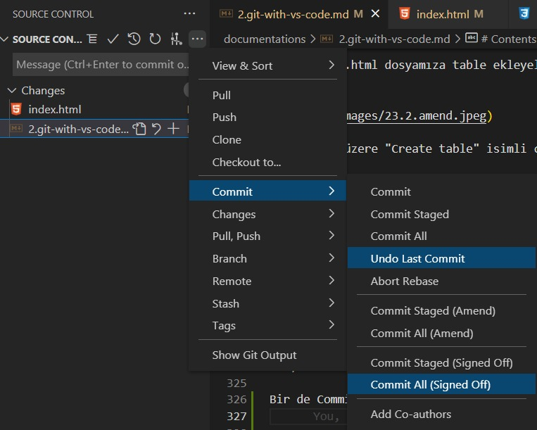

Bu şekilde commitleyince o commit de Signed Off yani bizim imzamızla kaydedilmiş olur.

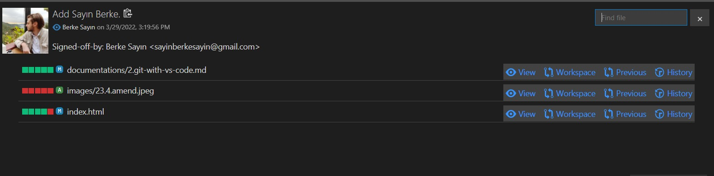

## Stash İle Değişiklikleri Saklamak 

Şimdi de "Stash" kavramına değinelim. Stash aslında yine git üzerinde oldukça kullanışlı bir komut ve özellik. Yaptığımız ya da o an üzerinde çalıştığımız değişiklikleri geçici olarak bir rafa kaldırmak gibi düşünülebilir. Elimizdeki son commite geri dönmek ama bir rafa kaldırmak, yani commitlemek değil. Ya da Staged Area'ya almak değil. Tamamen görmeyeceğimiz, yani working directory'mizi temizleyip eski commit'e geri dönmemizi sağlıyan bir komut. Böylece ihtiyaç duyduğumuz başka şeyleri yapıp ondan sonra o değişiklikleri tekrar alıp yolumuza devam etmemizi sağlıyor. Yani yapılan değişiklikleri geçici bir süre rafa kaldırmak diyebiliriz.

Örneğin index.html sayfamıza Send ve Apply isimli 2 tane buton ekleyelim. Sonra da script.js dosyamızda değişiklik yapalım. Biz bu değişiklikleri yaptık ve çalışmaya devam ederken tam o sırada bize bir istek geldi diyelim. Şu görevin yapılması gerekiyor veya şu kodun acil olarak yazılması gerekiyor şeklinde. Yani var olan bir görevi öne çektiler diyelim. Peki bu durumda ne olacak? Belki de yazdığımız bir sürü kod vardı, üzerinde çalıştığımız bir başka görevle ilgili ve o anda araya başka bir görev girdi diyelim. 

İşte bu durumda üzerinde yaptığımız değişiklikleri başka bir yere taşıyabiliriz, o da stash komutuyla oluyor. Eğer şöyle bir şey olsaydı, diyelim acil bir istek geldi ve dediler ki style.css dosyasında bir değişiklik yapılacak, yani böyle bir istek geldi. Aslında bu durumda biz hiç stash kullanmadan bildiğimiz yöntemle de ilerleyebiliriz. Yani style.css dosyasında değişiklik yaparız, gereken kodu yazarız, daha sonra da source kontrol alanında inde.html ve script.js'yi staging area'ya almadan sadece style.css'i o alana alarak da commitleyebiliriz ve kaldığımız yerden kendi işimizi yapmaya devam edebiliriz. 

Fakat ya üzerinde çalıştığımız dosyalarda bir değişiklik araya girmiş ise, sorun burada ortaya çıkıyor aslında. Yani üzerinde çalışıp bozduğumuz bir kod üzerinde değişiklik yapacaksak, mecburen yaptığımız değişiklikleri, modifikasyonları bir rafa kaldırmamız gerekebilir. 

Örneğin az önce index.html'de Send ve Apply isminde 2 buton oluşturmuştuk. İşte diyelim ki tam o sırada yine index.html'de farklı bir görevi yerine getirmemiz istendi. İşte bu durumda buton ekleme değişikliğini stash ile rafa kaldırırız. Bunun için source kontrol alanından Stash ifadesini mesajını da yazarak çalıştırabiliriz. 

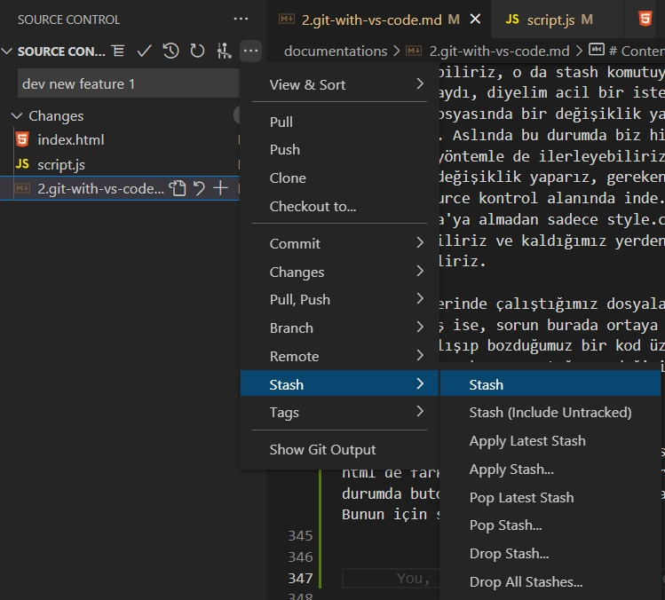

Burada yeni özellik geliştirilmesi şeklinde bir isim verdik. 

Böylelikle yaptığımız değişiklikler tamamen rafa kaldırıldı, yani bizi bir önceki commit haline geri döndürdü. Bizde artık bizden istenilen yeni göreve başlayıp onun üzerinde çalışabilriz. Mesela diyelim index.html'de yeni tablo satırı eklememiz gerekiyor, gidip o işlemi yaparız. Daha sonra bu değişikliği yapıp normal şekilde commit işlemimizi gerçekleştirebiliriz. Ardından tekrar eski işimize geri dönmemiz gerekiyor diyelim. Bunun için source kontrol alanında Pop Stash komutuyla o değişiklikleri geri alırız. Burada biz aynı anda birden fazla stash de yapabiliriz. Daha sonra Pop Stash komuduna basınca geri getirmek istediğimizi seçeriz. Bir de Latest Stash komudu var o da birden çok stash yaptığımız durumda en son gerçekleştirdiğimiz stash komudunu bize geri getiriyor. Pop Stash ile istediğimiz stash işlemini seçince biz nasıl bıraktıysak aynı o şekilde geri gelecektir.

Bu şekilde kodlarımız geri gelir ve çalışmaya devam ederiz. Hatta stash'e aldıktan sonra gerçekleştirmiş olduğumuz commit işlemi de kayıtlı kalır. 

Tabi şöyle durumlarda söz konusu olabilir. Mesela stash'in içerisindeki bazı kodlar bizim bir önceki o ufak geliştirmemizle çakışabilir. Bu gibi durumları yine bizim manuel olarak çözümlememiz bekleniyor. Bunu da Conflict olarak söyleyecektir. Bu durumu yine Conflict bölümünde değerlendireceğiz. Bunu çözüp yolumuza devam ederiz. 

Şu anda son değişiklikleri de commit 6 diyerek gönderelim. Böylelikle stash çalışmamızı da tamamlamış olduk. Bu şekilde yorumlanabilir. Dediğimiz gibi stash'i istediğimiz kadar kullanabiliriz. İstediğimiz kadar çok değişikliği stash'e atmamız mümkün. 

Son olarak bir de şundan bahsedelim. Yaptığımız değişiklikleri stash'e atarken şöyle durumlarla da karşılaşılabiliyor. Örneğin tamam üzerinde çalıştığımız dosya belli diyelim. Bu dosyada bir değişiklik yaptık. Dieylim index.html'de değişiklik yaptık. Var olan dosya üzerinde çalışırken sıkıntı yok ama bazen yeni dosyalar ekliyoruz. Örneğin index2.html dosyası ekliyoruz. Ama git yeni eklenen dosyaları U(Untracked) olarak görüyor yani git tarafından izlenmiyor. Çünkü yeni eklenen dosyaların git'e eklenmesi lazım ilk başta, ilk committe ekleniyor. Ama şu an commit yapmadığımız için izlenmeyen dosya konumunda. Fakat mesela biz şu anda bu dosyayı ekleme konusunda kararsısız diyelim. Çünkü çalışma yapıyoruz daha, kesin bir şeyler yok ortada. En son + ya basıp Stage'e ekleyeceğiz. Ve o dosyada artık takip ediliyor olacak. Fakat diyelim yine böyle bir görev geldi araya girdi ve bizim oradaki değişiklikleri stash'e atmamız gerekti. Bu durumda Stash'e basarsak, Untracked(U) yani izlenmeyen dosyalar Stash'e atılmıyor. Eğer biz izlenmeyen dosyalarla da beraber hepsinin atılmasını istiyorsak bu durumda Source Kontrol alanından Stash(Include Untracked) komutunu seçeriz.

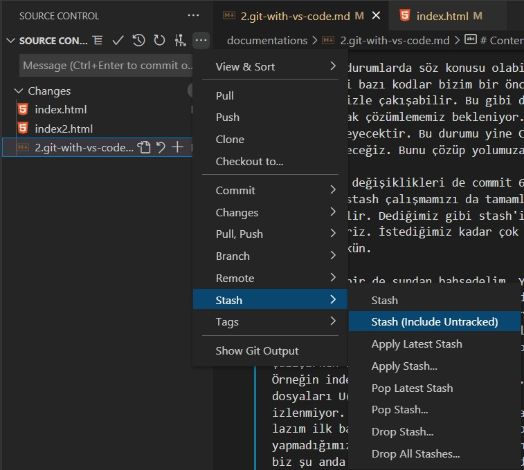

Böylelikle yine son commite dönebiliriz. 

Yani stash oldukça kullanışlı. Yani elimizde bir raf olduğunu düşünelim ve o rafa o anki değişiklikleri izlenebilir dosyalarla veya izlenmeyen dosyalarla beraber veya izlenmeyen dosyaları almadan elimizdeki değişiklikleri koyabileceğimiz bir raf var. İstediğimiz zaman değişiklikleri rafa kaldırıp tekrar alıp devam edebiliriz. 

## Stash'deki Değişiklikleri Uygulama, Silme ve Değiştirme 

Şimdi de Stash konusunda bizim için faydalı olabilecek bir eklenti - extension ile stash'lerimizi yönetmekten bahsedelim. Bir önceki derste Stash kavramını gördük, bir şeyleri stash'e eklemenin yollarını biliyoruz. Bir şeyleri stash'e atmak için "Stash" komutunu stash'ten almak için de "Pop Stash" komutunu kullanmamız gerektiğini biliyoruz. Fakat bunun dışında Stash ile ilgili Apply etme (yani oradaki bir stashi al ama silme stash listesinden) diyebiliyoruz. Ya da Stash listesindeki bir stashi artık kullanmak istemiyoruz bu durumda nasıl sileceğiz, ya da stash listesini nasıl temizleriz, işte bu gibi komutlar sourcek kontrol alanında yer almıyor. Burada sadece bir değişikiliği stashe atma ve oradan çekip almak, aldığını da stash listesinden silmesini sağlayan komutlar bulunuyor. Şimdi burada bu özelliklere değineceğiz. Bunları yapmaya çalışacağız. 

Şİmdi index.html, index2.html ve index3.html dosyalarında değişiklik yapıp inital commit ismiyle gönderelim. Şimdi buralarda bir şeyler yapıp stashe atacağız ve sonrasında bunları işliyor olacağız. 

Şimdi index.html'de değişiklik yapıp stashe atalım. 

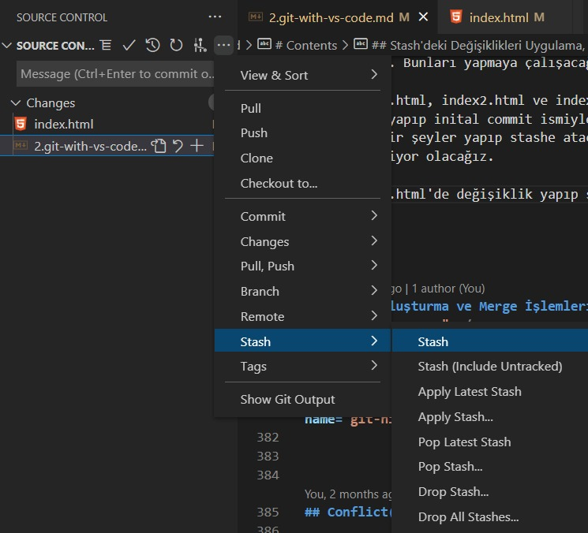

Stash ismi dev1 index olsun.

Şimdi stashde bir kaç şey biriksin istiyoruz. index2.html'de değişiklik yapıp onları da stashe atalım. O stashe de dev index2 diyelim. Aynı şekilde index3 sayfasında değişiklik yapıp dev index3 ismiyle stashe atalım. 

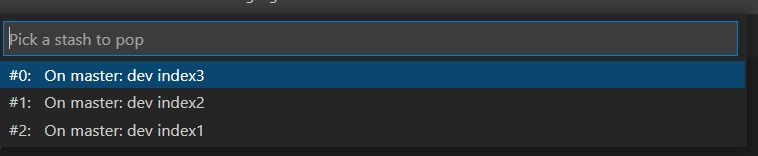

Stash'lerimiz şu anda bu şekilde birikti. Bu listedeki herhangi bir stashi seçince o kodlar uygulamamıza uygulanıp o listeden siliniyordu. Peki bi bu stash'leri nasıl listeden silmeden alırız veya almadan listeden sileriz, çünkü artık kullanmak istemiyor olabiliriz. Bunun için git merger isimli bir extension var onu indirebiliriz. Bu eklenti bize stash ve merge işlemlerinde yardımcı olur. Bu belli bir stashi silebiliyor, apply dediğimiz o stashi almak istiyoruz ama stash listesinden de silinsin istemiyoruz(gitmerger: unstash ile) gibi işlemler için kullanılıyor. Onun dışında merge işlemleri için kullanılabiliyor. Merge kısmında da bu eklentiyi kullanıyor olacağız. Şimdi burada yine ctrl + shift + p ile command palette yi kullanacağız.

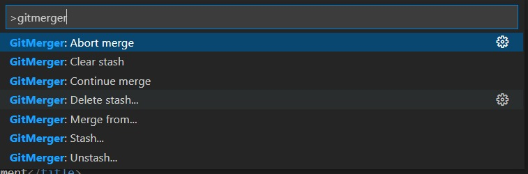

Unstash ile: Stashi alırız ama listeden silinmez.
Clear Stash ile: Tüm listeyi temizleriz.
Delete Stash ile: Bir stashi kullanmadan listeden kaldırırız.
Stash ile: Yapılan değişikliği stashe atarız.

Gördüğümüz üzere Stash işlemlerimizi Git Merger isimli eklenti sayesinde daha kolay bir şekilde de yöentebiliriz.

## Branch Oluşturma ve Merge İşlemleri 

Bu bölümde de branch ve merge kavramlarına değineceğiz. Öncelikle branch neydi bunu hatırlayalım. 

Brach; üzerinde çalıştığımız projenin herhangi bir commit noktasından, herhangi bir noktasından, örneğin commit 4 olabilir veya commit 1, commit 2 olabilir, son versiyon veya ilk versiyon olabilir, yani projenin herhangi bir commit noktasından o anki commitin kopyasının alınarak üzerinde korkusuzca geliştirme yapabileceğimiz bir kopyasının oluşturulmasıdır. Buna da branch denir. Biz bu branch'e isim veririz ve bunun üzerinde istediğimiz kadar commitler, farklı işlemler yapıp, bildiğimiz o stash'leri kullanabliriz, farklı denemeler yapabilirz, yani ayrı bir kopya üzerinde çalışırız, ilerleriz. 

Sonra da istersek bu kopyanın üzerindeki değişiklikleri bu ayrı dal üzerinde ayrı bir versiyon olarak devam ettiririz, yani projeye bu noktadan devam ederiz, istersek de bu branch'teki değişiklikleri ana projeye yani ana kısma tekrar dahil edebiliriz ki bu dahil etme işlemine de merge deriz. Merge yapıp sonrasında istersek (keyfimize kalmış) branch'i de silebiliriz. 

Bu işleme branching ve merging deniyor. Bu çok kullanışlı bir özellik. Korkusuzca bir şeyleri değiştirebilmemizi, projenin üzerine oynamamızı sağlıyor. Bu sayede projeyi bozmaktan korkmadan ilerleyebiliriz. 

Biz herhangi bir noktadan istediğimiz kadar dal oluşturabiliriz. Yani ağacın dalları gibi iç içe / alt alta branchler oluşturabiliriz, ilerleme yapabiliriz. 

Şimdi de bu işlemleri VS Code üzerinde deneyelim. Şimdi elimizde bir proje var. Onun içerisinde de 3 tane dosya bulunuyor. (index.html, index2.html ve index3.html) 

Şimdi Feate Branch'inden geri geldik ve index.html'e bir h2 başlığı ekledik. Bu değişikliği commit 2 master diyerek gönderelim. 

Biz çalıştığımız klasörü(working directory) git'e eklediğimiz zaman mutlaka bir branch oluşur. Bu branch'e de master branch denir. master branchi mutlaka oluşur ve bu ana branchtir. Buradan dallanmalar oluşturabiliriz. Burada da öyle yapacağız. Branch alırken o anki son noktadan yani son committen bir branch oluşturmak istersek sol altta bulunan "master işaretine" tıklayıp "Create a New Branch" diyebiliriz. 

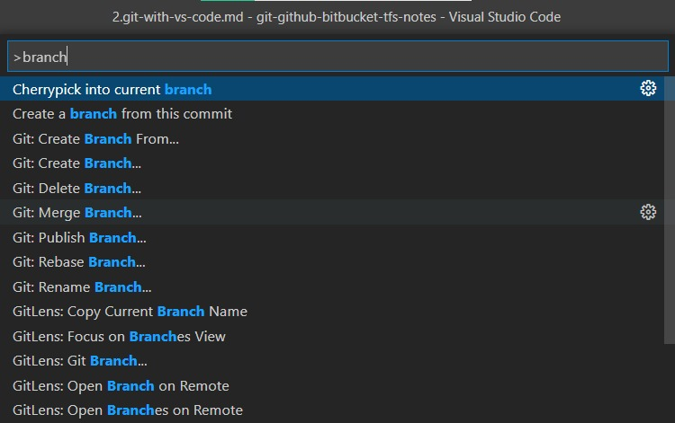

Burada master'a tıklarız. Ve sonra da Create a new branch deriz. 

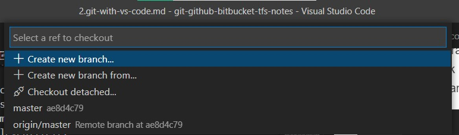

Burada search bar'a Feate ismini yazarak o isimde bir branch oluşturalım. Şuanda Feate isminde bir branch oluşturuldu ve o branche geçildi. 

Sol altta göründüğü gibi şu anda Feate branch'ındayız:

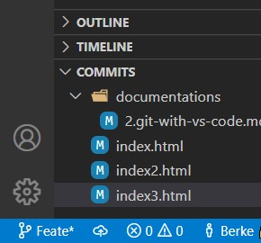

Bu noktada yaptığımız değişiklikler Feate branchına ekleniyor olacak. örneğin index3.html'de 3 tane paragraf oluşturalım. Sonra da bir tane index4.html dosyası oluşturalım ve içerisine bir tane paragraf ekleyelim. Şu anda bu yaptğımız değişiklikleri normaldeki gibi commit edebiliriz.

Şu anda bu değişiklikler Feate branch'ına kayededildi. Biz sol alt köşede bulunan alandan istediğimiz gibi branch değiştiriebiliriz, istediğimiz branch'e geçebiliriz. Ayrıca bizim Feate de yaptığımız değişiklikler ve commitler artık oraya ait, biz master'a geçtiğimizde orada gözükmezler, çünkü ana branch'e merge yapmadık henüz, sadece yeni branch oluşturup onun üzerinde commitler yaptık. Yani şu an birbirinden bağımısız ilerleyen iki farklı dal(branch) var:

- Master branch 
- Feate branch 

Şimdi ise Git History ekranımızı açalım. 

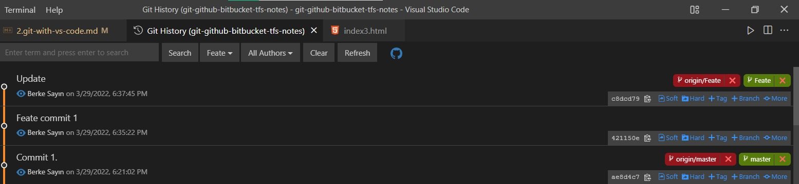

Burada commitlerimizi hangi branch üzerinde oluşturduğumuzu da görüntüleyebiliriz. Ayrıca orada gözüken Nav-Bar kısmında istediğimiz brach için oluşturulan commitleri de seçip görüntüleyebiliriz. 

Şimdi de örneğin master branch'ine gidip bir değişiklik yapalım.

Gördüğümüz gibi biz branchler arasında gezebiliyoruz, istediğimiz özelliği istediğimiz branch'te deneyebiliyoruz. Şimdi de merge özelliği ile çalıştığımız branchi ana projeye taşımayı görelim. 

Yani diyelim ki biz yeni bir branch'te(buradaki örnek için Feate branchi olsun) yeni özellikler denedik ve o özellikler çalıştı başarılı oldu. Artık bunu ana branch'imizle yani master branch'imizle birleştirmek istiyouz yani merge etmek istiyoruz ve merge işleminden sonra da belki de Feate branch'ını sileceğiz. Bunu yapmak için ise ilk önce birleştirmek istediğimiz branch'e gideriz. Yani master branch'ine. Bu branch'teyken command palette'ye gidelim.
 

Yani master branch'i de kendi içinde commitlerine devam ediyor, Feate branch'i de kendi içinde commitlerine devam ediyor.  

Git Graph eklentisi ile commit'lerin dallanma - branching yapısını görüntüleyebiliriz. 

Gördüğümüz gibi biz branchler arasında gezebiliyoruz, istediğimiz özelliği istediğimiz branch'te deneyebiliyoruz. Şimdi de merge özelliği ile çalıştığımız branchi ana projeye taşımayı görelim. 

Yani diyelim ki biz yeni bir branch'te(buradaki örnek için Feate branchi olsun) yeni özellikler denedik ve o özellikler çalıştı başarılı oldu. Artık bunu ana branch'imizle yani master branch'imizle birleştirmek istiyouz yani merge etmek istiyoruz ve merge işleminden sonra da belki de Feate branch'ını sileceğiz. Bunu yapmak için ise ilk önce birleştirmek istediğimiz branch'e gideriz. Yani master branch'ine. Bu branch'teyken command palette'ye gidelim ve orada Git: Merge Branch'i seçelim. 

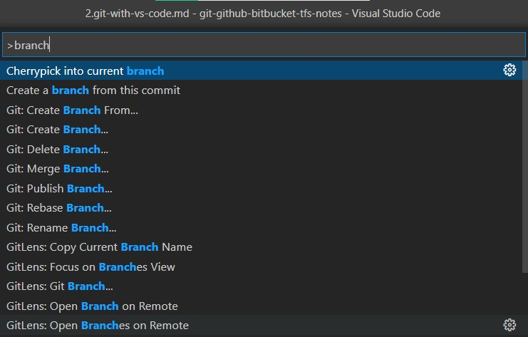

Buradan Git Merge Branch'ı seçelim.

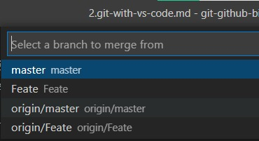

Burada da biz şu an master'dayız, Feate'yi birleştirmek istiyoruz, o yüzden Feate branch'ını seçeriz. Şu anda merge işlemi gerçekleşti. Ve de Feate branch'ında yaptığımız değişiklikler master'a taşındı. 
 

## Git History İle Branch Oluşturma 

## Conflict(Çakışma) Yönetimi 

## Tag(Etiket) Kullanımı 

## Ignore Dosyaları Önemi ve Kullanımı 

- `Git Ignore` dosyaları adından da anlaşılacağı gibi Git'in Ignore ettiği, yani gözardı ettiği dosyalardır. Buna şu gibi durumlarda ihtiyaç duyabiliriz. Örneğin Visual Studio Code, Visual Studio veya herhangi bir kod editörü / IDE ile çalışıyoruz. Bu durumda atıyorum Visual Studio'nun kendi ürettiği geçici temp dosyalar olabiliyor veya bir projeyi çalıştırdığımızda o projeyle alakalı geçici exe'ler, objeler, klasörler oluşturabiliyor. Bunlarda aslında projenin içerisinde oluşuyor. Biz her ne kadar IDE üzerinde klasör yapısında görmesek de bunlar arkada oluşmuş oluyor ve git bunları takip ediyor. Git aslında her şeyi her hareketi takip ediyor, normalde yok saymıyor. Dolayısıyla o geçici dosyalarda takip edildiği için bizim commit'lerimiz arasında yer alıp versiyonlanmaya başlıyor. Ama o dosyaların aslında versiyonlanmasına ihtiyacımız yok, onlar geçici dosyalar. Bizim esas klasörlerimiz / dosyalarımız projeyi geliştirirken oluşturduklarımızdır. Biz Git'in esas dosyaları takip etmesini sağlayıp geçici dosyaları ignore etmeliyiz. Dolayısıyla bunun için de `.gitignore` dosyaları var. 

- Biz `.gitignore` dosyası içinde yapılan tanımlamalar ile istediğimiz dosyaların veya klasörlerin takibini iptal edebiliyoruz. .gitignore dosyası içerisinde * gibi karakterler kullanılarak farklı pattern'ler kullanabiliyor, onlar da farklı anlama geliyor. 

- Normalde Visual Studio ile çalışırken VS arkada `bin` klasörü üretir, biz de burada ona benzer bir yapı olması için bir bin klasörü ve onun içerisinde de debug, release klasörlerini ekleyelim.

- Bir de örnek olarak `test.html` isminde bir dosya oluşturalım, içerisine html template'i ekleyip body'de bir şeyler yazalım ve git tarafından ignore edilmesini yani takibe alınmamasını sağlayalım. Bunun için bir de `.gitignore` isimli dosya oluşturmamız gerekli.

- Şimdi biz `test.html` dosyasının git tarafından ignore edilmesini sağlamak istiyoruz. Bunun için `.gitignore` dosyasına gidip test.html yazıp save ile kaydederiz ve artık test.html dosyası git tarafından ignore edilir, yani tekip edilmez. Yani istenen belirli bir dosyayı adını ve uzantısını yazarak ignore ettirebiliriz. 

- `gitignore` dosyaları içerisinde `#` işareti açıklama satırı yazmak için kullanılır. 

- Bir de diyelim ki `bin` klasörü içerisindeki `debug` klasörünün de ignore edilmesini istiyoruz. Bunu nasıl yaparız? Bunun için de klasörün adını yazarız. 

- Şu anda .gitignore dosyası ile bin klasörü aynı dizinde, biz ise bin içerisindeki debug klasörünün ignore edilmesini istiyoruz. Onun için de;
`.gitignore` dosyası içerisinde  `bin/debug` yazarız ve artık bin içerisinde bulunan debug klasörü ignore edilir. 

- `bin/` : `.gitignore` dosyasına bunu yazarsak `bin` klasörü tamamen ignore edilir. 

- Proje içerisindeki css uzantılı tüm dosyaların ignore edilmesi için şu ifadeyi kullanırız: `*.css`

- Aynı şekilde istediğimiz uzantıya ait dosyaları ignore etmek için bu yöntem kullanılır. 

- Bir klasörün altındaki belli bir uzantıya ait tüm dosyaları (sadece bin içerisinde, bin içindeki başka bir klasör içinde değil) ignore etmek için de şu yöntem kullanılır: `bin/*.css`

- Bir klasörün altında herhangi bir klasör içerisinde bulunan tüm css uzantılı dosyaları ignore etmek için: `bin/*/*.css`

- İlk harfi "B" ya da "b" ile başlayan "bin" isimli klasörü takip etmemek için: `[Bb]in/`

- Eğer bu `.gitignore` ayarını baştan yaparsak projenin doğru bir şekilde takip edildiğini görürüz. 

- 

