# Terminal İle Git Kullanımı

# Contents
* [Git Komut Çalıştırma Araçları](#git-commands)
* [Git Bash, PowerShell ve Command Prompt ile Git Versiyon Kontrolü](#git-commands-tools)
* [Bazı Temel Terminal Komutları](#basic-terimnal-commands)
* [Init, Add ve Commit Komutları](#init-add-commit)
* [Status, Log ve Show Komutları](#status-log-show)
* [Checkout ve Reset Komutları](#checkout-reset)
* [Branch, Checkout ve Merge Komutları](#branch-checkout-merge)
* [Tag Komutları](#tag-commands)
* [Stash Komutları](#stash-commands)

## Git Komut Çalıştırma Araçları 

- Git komutlarını Visual Studio Code üzerinde kullanmayı geçtiğimiz bölümlerde gördük. Fakat biz Git komutlarını ayrıca terminal üzerinde de çalıştırabiliriz. Yazılım geliştirme sürecinin çoğunluğunda da terminali daha sık kullanıp, geliştirme yaptığımız kod editörünün arayüzünden daha az faydalanabiliriz. Bu durum için de terminal ile git komutlarını nasıl kullanırz, hangi komut ne işlemini ifade eder, bunları daha iyi bilmemiz gerekir. Bu bölümde bu konuları işleyeceğiz. 

- Komutları farklı terminallerde çalıştırabiliriz. Bunlara örnek olarak aslında "Git Bash", "Windows Powershell", "Command Prompt" u söyleyebiliriz. Git Bash, git'e özel bir terminal olduğu için farklı renklendirmeler de sağlıyor, daha kullanışlı olabiliyor, daha güzel çıktılar verebiliyor. 

- Kodları yazdığımız kod editöründe git işlemlerini gerçekleştirebilecek arayüz olmayabilir veya olsa bile karışık gelebilir, kullanışlı olmayabilir. Fakat bizim her durumda projemizi versiyonlamaya ihtiyacımız var, bunun için de terminal(komut satırı) kullanırız. 

## Git Bash, PowerShell ve Command Prompt ile Git Versiyon Kontrolü 

- Şimdi de Git Bash, Command Prompt ve Powershell toollarını görelim, nasıl kullanıyoruz, kısaca değinelim. Windows'ta veya diğer işletim sistemlerinde Powershell'e benzer şekilde terminal mevcuttur.  

- Git Bash: 

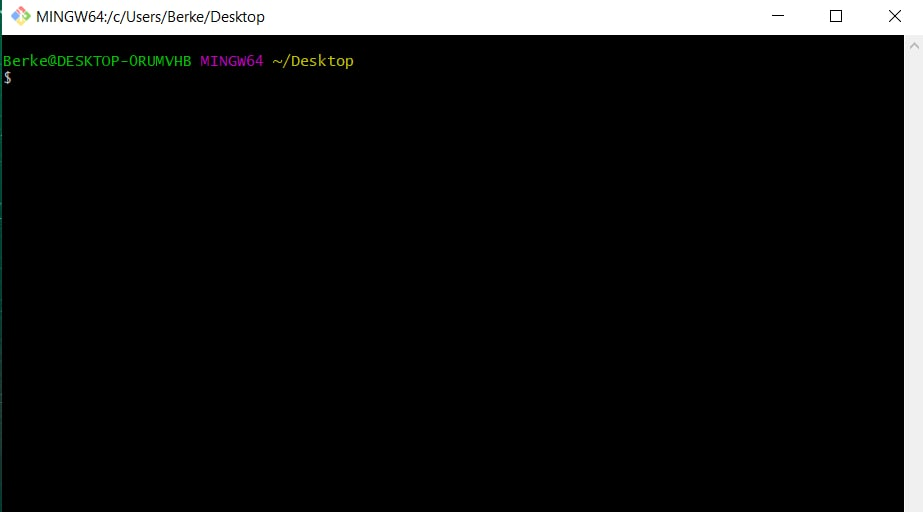

- Bu Git Bash terminali(komut satırı). Burada git komutlarımızı yazıp çalıştırabiliriz ve projemizi istediğimiz komutları kullanarak versiyonlayabiliriz, yönetebiliriz. 

- Burada içerisinde bulunduğumuz dizin önemli. Hangi projede çalışmak istiyorsak o dizine, o projeye locate olmamız gerekir.

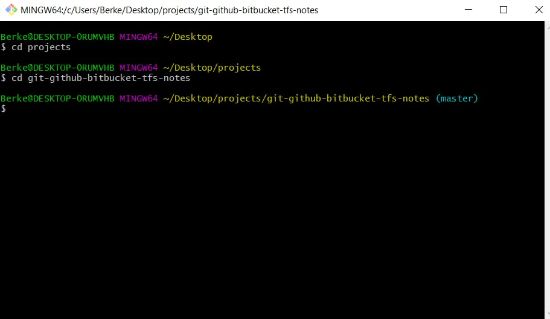

- Ayrıca bu terminalde git yazıp enter'a basarsak git yardım dökümanı açılır ve ondan da faydalanabiliriz. 

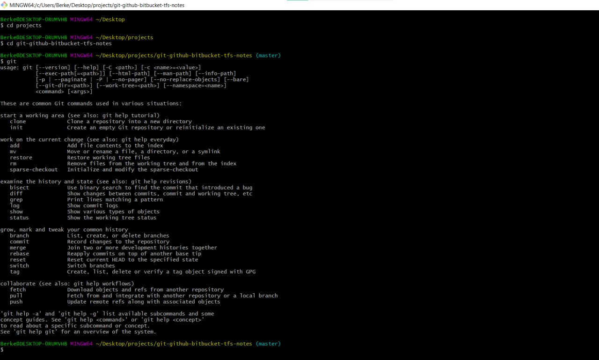

## Bazı Temel Terminal Komutları 

- Terminalde komutları hangi projede / klasörde kullanmak istiyorsak ilk olarak o dizine locate olmamız gerekir. 

- Şu anda biz Desktop'ta Git Bash terminalini açtık ve projemize locate olmak istiyoruz. 

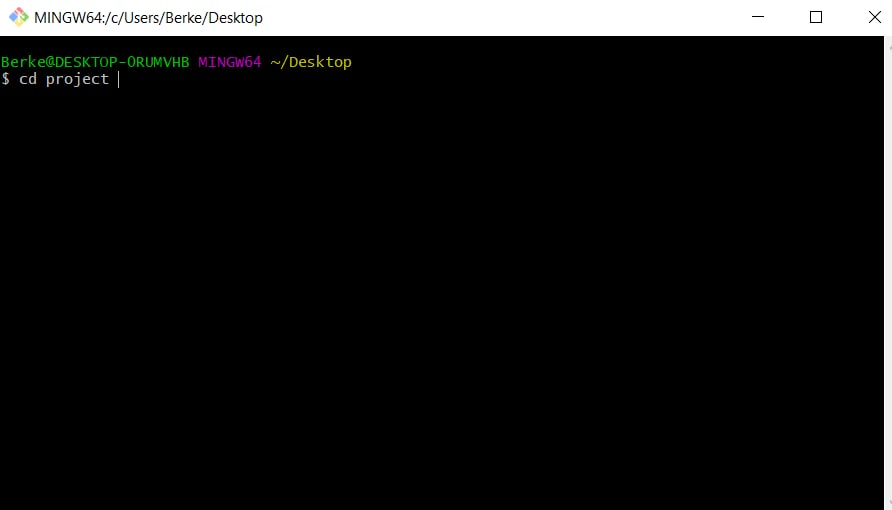

- 'cd' komutu aslında 'change directory' anlamına geliyor. Biz şu anda desktop'ta bulunuyoruz, bunu en üst satırda görebiliriz. Aynı zamanda projects içerisinde bulunan git-github dizinine gitmek istiyoruz. Bunun için ilk olarak `cd projects` ile projects dizinine gideriz.

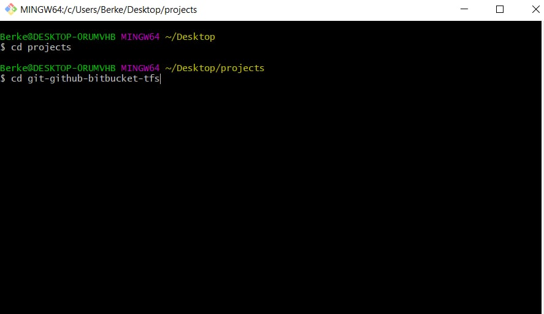

- Daha sonra da projects klasörü altında bulunan git-github-bitbucket-tfs folder'ına gitmek için `cd git-github-bitbucket-tfs` yazarız. 

- Bu şekilde istediğimiz klasöre locate olabiliriz. Ayrıca bulunduğumuz dizinden bir geri gelmek için de `cd ..` komutunu kullanırız. 

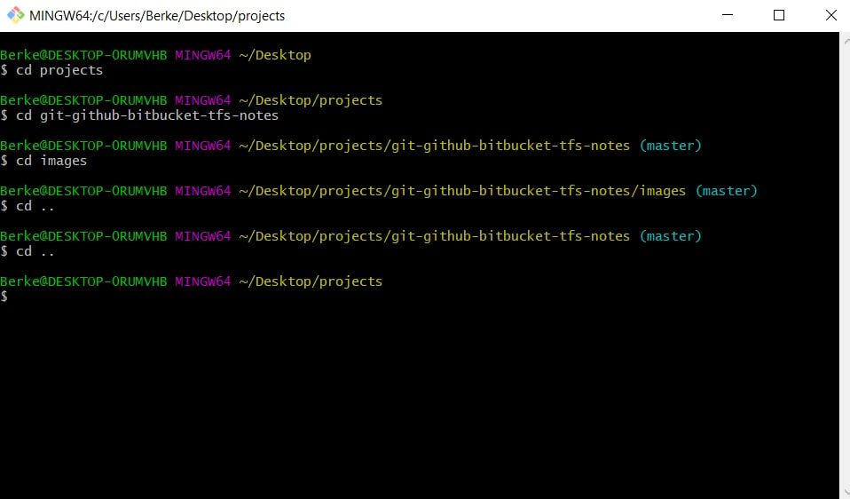

- Bu şekilde hangi klasörle çalışmak istiyorsak ona locate olmamız gerekli. Ayrıca tek tek ileri geri gitmek yerine doğrudan istenilen adrese ulaşmak için de şu komut kullanılır: 

`cd C:\Users\Berke\Desktop\projects\git-github-bitbucket-tfs-notes\images` 

`dir`

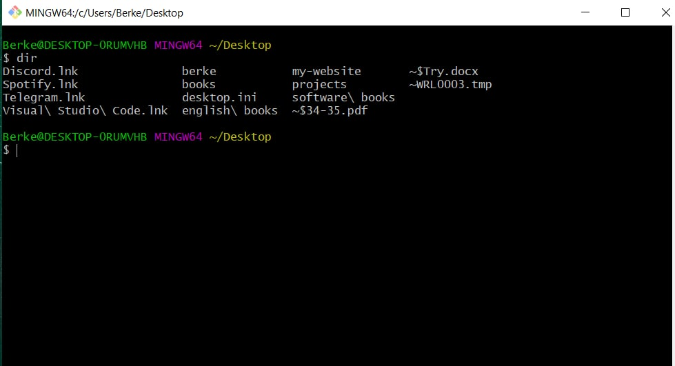

- Ayrıca bir klasör altında bulunanları görmek için de `dir` komutunu kullanabiliriz. 

`ls`

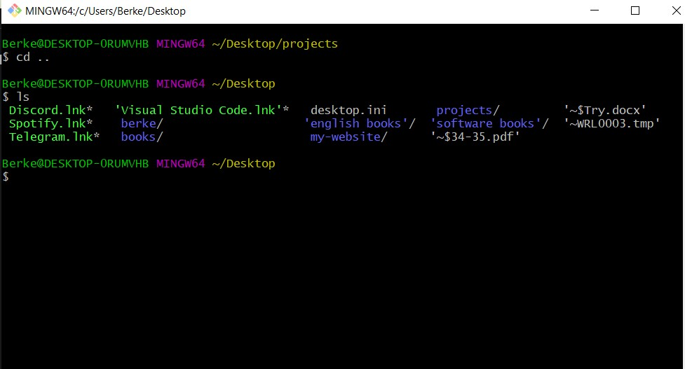

- `ls` komutu da `dir` komutu ile aynı işi yapar. Bir klasör altında hangi klasörler, dosyalar, uygulamalar bulunuyor görmemizi sağlar. 

- `mkdir "new-folder"` bu komut ile de bulunan dizinde yeni bir klasör oluşturulur.

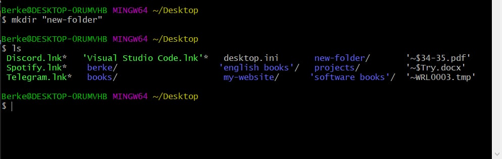

## Init, Add ve Commit Komutları 

- Git ve versiyon kontrolü bize proje oluşturmada değil projeyi yönetme aşamasında kolaylıklar sağlıyor. Burada başlangıç olarak birkaç git komutuna bakalım.

- `git init` : Bu komut ile oluşturduğumuz proje bir 'git repository' si haline geltirilir. Yani klasör artık git tarafından takibe alınır. 

- `git add .` : Bu komut ile proje içerisindeki bütün dosyalarda yapılan değişiklikler 'Staging Area'ya alınır, yani commit edilmeye hazır hale getirilir. 

- `git add [file_name]` : Bu komut ile de seçili olan dosyadaki değişiklikler 'Staging Area'ya alınır, yani commit edilmeye hazır hale getirilir.

- `git commit -m "commit message"` : Staged Area'da bulunan değişiklikler commit edilir, yani belli bir ID ile git veritabanına kaydedilir. 

- Visual Studio Code'da çalışırken `ctrl + j` ile VS Code alt tarafta terminali açıp komutları çalıştırabiliriz. 

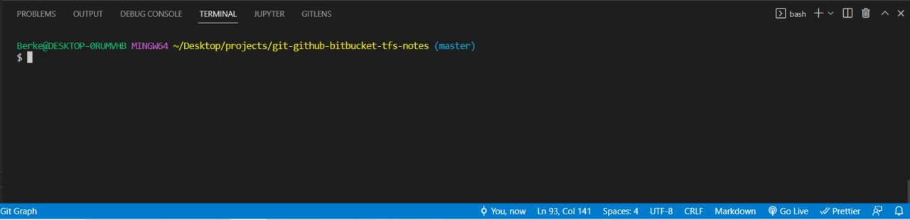

- Burada şu anda projemize locate olmuş durumdayız ve bu proje için yukarıdaki komutları da tüm komutları da buradan çalıştırabiliriz. 

- Ayrıca ister kod editörü veya IDE'lerin bize sağladığı terminalleri kullanabiliriz, örnek olarak VS Code'da alt tarafta açtığımız Git Bash terminali, istersek de ayrı bir pencere olarak kod editörünün dışında açarak oradan çalıştırabiliriz. Bu durumda ilk olarak çalışmak istediğimiz projeye locate olmamız gerekli. 

- `git add` , `git commit -m "commit message"` , `git push` komutları.

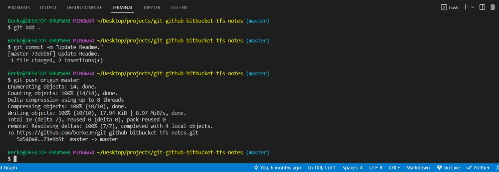

- `git init` komutu en başta sadece bir sefer proje için çalıştırılır, böylece proje bir git repository'si haline gelir. 

## Status, Log ve Show Komutları 

- `git status` : Henüz commit edilmemiş, yeni veya güncellenen dosyaları listeler. Yani en son commit işleminden sonra neler yapılmış, hangi dosyalar Staging Area'ya alınmış, hangileri değiştirilmiş fakat Unstaged durumunda, bunları görmemizi sağlıyor. 

- `git log` : Tüm commit geçmişini görüntüler. 

- `git show [commit]:[file]` : Belirli bir commit detayını görüntüler. 

##### Git Status:

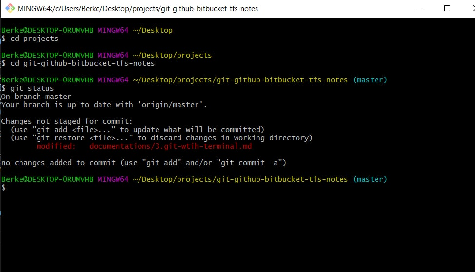

- Burada şu anda master branch'te bulunduğumuzu görebiliyoruz. Ayrıca bir dosyanın modified olup henüz staging area'ya alınmadığını ve commit'lenmeye hazır olması için önce `git add .` komutuyla staging area'ya eklenmesi gerektiğini görebiliyoruz. 

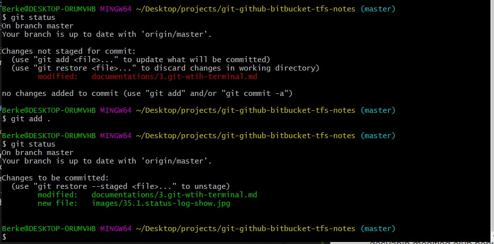

- Şimdi ise yapılan değişiklikleri `git add .` ile Staging Area'ya aldık. Şu anda 'modified' yazısı artık yeşil şekilde görünüyor ve değişikliklerin commit edilmeye hazır olduğu belirtiliyor. 

##### Git Log:

- `git log` komutuyla ise daha önce yapılan commit'leri en sondan en başa doğru listeler. 

- Burada olduğu gibi `git log` komutyla proje içerisinde yapılan commit'ler en sondan en başa doğru listelenir. Yapılan commit'in ID'si, kim tarafından ne zaman yapıldığı ve commit mesajı gösterilir. 

##### Git Show:

- `git show <commit_id>` komutu ile de o commit işleminin detayını, yani o commitle hangi dosyalarda neler yapıldı, neler değiştirildi, kim ne zaman değiştirdi, bunları görürüz. 

## Checkout ve Reset Komutları 

- `git checkout` : Bu komut hem mevcut branch'ten farklı bir branch'e geçiş yapmak için, hem de başka bir durumda bir dosyada veya dosyalarda yapılan değişiklik henüz `git add .` ile 'Staging Area' ya alınmadan, o değişiklikleri iptal etmeyi, en sonki commit haline dönmeyi sağlar. 

- `git reset [file]` : Bir dosyada veya dosyalarda değişiklik yapıp daha sonra `git add .` ile 'Staging Area' ya aldık diyelim. Fakat onları Staged durumundan tekrar Unstaged durumuna getirmek istiyoruz. Bu durumda ise bu komutu kullanırız. Değişiklikler Staged konumundan tekrar Unstaged konumuna gelir, fakat yapılan değişiklikler durmaya devam eder. İstediğimiz zaman tekrar Staged durumuna alabiliriz. 

- `git reset --hard` : 

## Branch, Checkout ve Merge Komutları 

## Tag Komutları 

## Stash Komutları 

