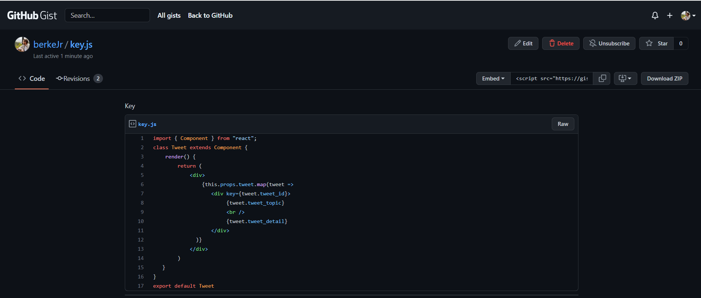

# GitHub

# Contents
* [GitHub Nedir? Github ile Çalışmak](#github-intro)
* [GitHub Hesabı Oluşturmak](#github-account)
* [GitHub Gist ile Kod Parçalarınızı Saklamak](#github-gist)
* [GitHub Repository'si Oluşturmak](#repository)
* [GitHub Üzerinde Commit, Edit ve Delete İşlemleri](#commit-edit-delete)
* [GitHub Repository Settings(Ayarları)](#github-settings)
* [GitHub Web Pages(Sayfalar) Kavramı](#github-web-pages)
* [GitHub Issues(Görevler) Bölümü](#github-issues)
* [GitHub Projects(Projeler) Bölümü](#github-projects)
* [GitHub Wiki(Rehber) Bölümü](#github-wiki)
* [GitHub Insights(Raporlar) Bölümü](#github-insights)
* [GitHub Fork(Repo Kopyalama) İşlemleri](#github-fork)
* [GitHub Pull Request(Çekme İsteği Nedir?)](#github-pull-request)
* [GitHub Pull Request(Çekme İsteği) Uygulama](#github-pull-request-app)

## GitHub Nedir? Github ile Çalışmak 
- Bu bölümde GitHub nedir, Github ile nasıl çalışırız, proje geliştirme sürecinde bize neler sağlar, bu konulara değineceğiz. Öncelikle Git ve GitHub'ın ayrımını yapmak önemli, çünkü bu 2 kavram çok fazla birbirleriyle karıştırılabiliyor. Git; şimdiye kadar öğrendik ki, local'imizde arkada çalışan bir servis. Bize repository / proejeler üzerinde versiyon kontrolünü sağlıyor. Böylelikle proje yönetimini ve takibini yapıyoruz. 

- Github ise, daha ziyade bir web sayfası / uygulaması. Bize internet / web üzerinde hizmet veriyor. Bu servisi sağlarken de, bize uzak(remote) bir repository kavramı sunuyor. Yani genel olarak, ekip halinde geliştirilen yazılım projelerinde internet tabanlı bir depolama ve yönetim alanı sunar. GitHub, Git yönetim sistemi ile geliştirilen yazılımlarda / uygulamalarda kullanılır. 

- Biz projelerimizi, uygulamalarımızı GitHub'a yüklüyoruz ve GitHub'da arka planda Git işlemlerini / komutlarını kullanarak bize proje yönetimi, ortak proje geliştirme, açık kaynak kodlara katkıda bulunma gibi imkanları sağlıyor. Bize sunduğu web sayfası / arayüz üzerinde biz repo'ları yönetiriz. 

- Yani Git; bizim arkada çalışan repo'muzu, yazılımsal projeleri yönetmemizi sağlayan bir motor ise GitHub'da bu motoru kullanarak sağladığı arayüz ile proje yönetim işlemlerini bize sunan bir yapı. 

## GitHub Hesabı Oluşturmak 
- GitHub sitesinin adresi: https://github.com

- Git ve GitHub arasındaki farklara, ikisinin de çalışma mantığına değindik. Şimdi de GitHub ile çalışmaya yavaş yavaş başlayalım. Aslında günümüzde çoğu firma GitHub kullanıyor, fakat burada sabit düşünmemek lazım. Firmalar GitHub kullandığı gibi aynı zamanda farklı projeler ve farklı ihtiyaçlar doğrultusunda GitHub dışında farklı hizmetleri de kullanabiliyorlar. Her proje takımı farklı ihtiyaçlarına göre farklı servisleri kullanabiliyor. 

- GitHub, review'lar ile kod takibi, birlikte çalışma ve aynı projeye ortak katkıda bulunma yöntemi, proje geliştirme süreci boyunca yapılan commit'ler hakkında tartışma, iletişim gibi takım arkadaşlarının veya başkalarının commit'lerini görebilmek ve onlar hakkında yorum yapmak, ve bu süreci yönetebilmek gibi olanakları sağlıyor. 

- GitHub ayrıca içerdiği Project Management Tool ile proje yönetimini de sağlıyor. 

- Ayrıca GitHub Marketplace ile farklı araçlarla birlikte kullanabiliriz. GitHub üzerinde çalışan işlerimizi kolaylaştıran eklentiler, araçlar ile verimliliğimizi arttırabiliriz. 

- GitHub'da kendi takım arkadaşlarımızla çalışabilmemize ek olarak başkalarının yazdığı repo'ları, kodları görebiliyoruz, aslında GitHub'ı yazılımın sosyal ağı olarak düşünebiliriz. Yani burada public projeleri görebiliyoruz, onlara katkıda bulunabiliyoruz, yani bir bakıma burada kendi projelerimizde de kullanabileceğimiz çok geniş bir kaynağa sahip oluyoruz. 

- Diğer uygulamalarda olduğu gibi burada da Sign-Up ile kayıt olup hesap açtıktan sonra bütün bu servislerden faydalanabiliyoruz, kullanabiliyoruz. 

- GitHub'da yazdğımız kodlar, ekledğimiz, yönettiğimiz projeler, açık kaynak olan başka repo'lara katkılarımız aslında bizim bir portföy'ümüz, cv'miz oluyor. O sebeple düzenli GitHub kullanımı ve proje geliştirme ve yönetme süreci, yazılımcılar için çok önemli. 

## GitHub Gist ile Kod Parçalarınızı Saklamak 

- GitHub Gists: https://gist.github.com

- My GitHub Gists: https://gist.github.com/berkeJr

- GitHub Gists ile biz istediğimiz kod bloklarını, yapılarını saklayabiliyoruz, orada not edebiliyoruz, ve istediğimiz zaman bakıp kullanabiliyoruz. 

- İstersek yukarıdaki linklerden Gists oluşturma ve oluşturduklarımızı görme ekranına gelebilriz, istersek de kendi GitHub profilimizden "Your Gists" alanını seçerek görüntüleyebiliriz.    

- Yani aslında burası kod defteri gibi bir alan. "New Gist" diyerek Gist'imizi oluşturabiliriz. "View Your Gists" ile de daha önce kaydettiğimiz Gists'leri görebiliriz. 

- Gist'lerimizi de tıpkı repo'lar gibi ister public, istersek de private yapabiliriz. 

- Örnek bir GitHub Gist:

 

## GitHub Repository'si Oluşturmak 

## GitHub Üzerinde Commit, Edit ve Delete İşlemleri 

## GitHub Repository Settings(Ayarları) 

## GitHub Web Pages(Sayfalar) Kavramı 

## GitHub Issues(Görevler) Bölümü 

## GitHub Projects(Projeler) Bölümü 

## GitHub Wiki(Rehber) Bölümü 

## GitHub Insights(Raporlar) Bölümü 

## GitHub Fork(Repo Kopyalama) İşlemleri 

- Şimdi de GitHub üzerinde "Fork" kavramına bir bakalım. Fork, aslında repository'leri kopyalamak için kullandığımız bir teknik. İster o repo'da takım arkadaşı olalım, yani söz sahibi, collaborator(commit atma yetkisine sahip geliştirici), istersek de söz sahibi olmadan, dışarıdan public repo'ya erişip o şekilde kendi hesabımıza Fork işlemi ile bir kopyasını alabiliriz. Yani collaborator veya contributer olmamız fark etmiyor, her türlü Fork'lama yapıp kopya alabiliriz ve daha sonra kendi hesabımızdaki kopya üzerinde özgürce takılabiliriz, sanki repo'nun sahibi bizmişiz gibi. Aslında repo'nun o anki kopyasını almış oluyoruz ve kimden aldığımızda altında belirtiliyor. Dolayısıyla bu şekilde, sanki repo bizimmiş gibi, ekleme, çıkarma yapabiliyoruz, özgürce çalışabiliyoruz. Ama orjinal repo sahibine bu değişiklikler yansımayacaktır. Bizim kendi hesabımızdaki kopyada bu işlemler gerçekleştirilir. Ona yansıtma işlemi ise "Pull Request" dediğimiz kavram ile oluyor. 

- GitHub'da herhangi bir open source (public) projeyi inceleyip istersek Fork ile kopyasını alabiliriz. Bu durumda incelediğimiz repo'nun içerisinde bulunan "Fork" işleminden faydalanırız. Aynı şekilde projenin kaç kişi tarafından fork'landığı da gösterilir. 

- Fork'ladığımız proje de çalışırken, değişiklikler yaptığımızda bu direk olarak repo sahibine, yani ana repo'ya yansımaz, bu işlem için Fork'a ek olarak "Pull Request" işlemi gerçekleştirilmelidir. 

- Ayrıca biz bir repo'yu beğendimizde ona star atabiliriz veya o repo'yu kaç kişi star'lamış, onu da görebiliriz. Ona ek olarak eğer biz bir repo'yu "Watch" ile izlemeye alırsak, o repo içerisindeki bütün commit veya request'te veya proje içerisindeki herhangi bir conversation'larda, konuşmalarda, yorumlaşmalarda bize de bildirim gelir. 
 

## GitHub Pull Request(Çekme İsteği Nedir? 

## GitHub Pull Request(Çekme İsteği) Uygulama 

